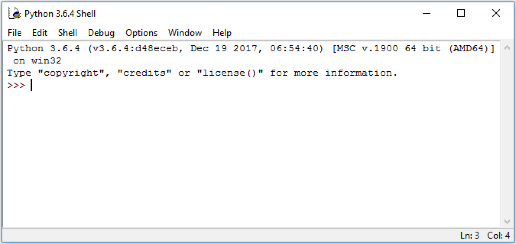
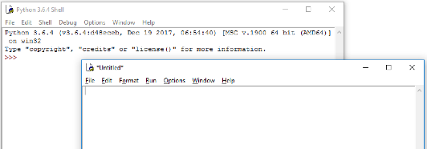
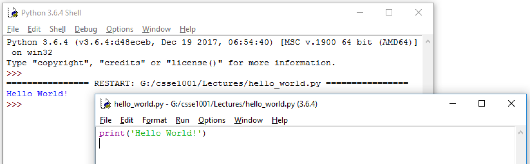

> <p>Uhh, you do realise, uh, he has to be, uh,... well, dead,... by the terms of the card, uh, before he donates his liver.</p>
> <p class="indent">— Monty Python’s The Meaning of Life</p>
{: .blockquote}

## Python Programming

### Writing Software
Software is often written by using a program called an **Integrated Development Environment**, or **IDE**. An IDE typically consists of an editor (often with syntax highlighting and layout support), a compiler or interpreter, class or library browsers and other tools to aid in software development and maintenance.

In this course we will be using **IDLE**, which is an IDE for Python.

When IDLE is started it will look something like this.



The window shown contains the running interpreter. The `>>>` is the interpreter prompt – the interpreter is waiting for user input. **Note**: This image is taken from Windows 10 and will appear different depending on the Operating System you are using.

Below is a simple example of an interaction with the interpreter – note the syntax highlighting used by IDLE. The user inputs an expression at the prompt (followed by pressing Enter) and the interpreter responds by printing the result and another prompt.
<div class="viz">
	
```python
>>> 2+3
5
>>> 6*7
42
>>> print("I don't like spam!")
I don't like spam!
```
</div>

### Using IDLE to write code
Once we get beyond simple examples in the interpreter, we typically want to be able to save our code so we can use it again later. We can do this by writing our code in a file. IDLE has an editor window that enables us to write our code and save it into a file.

In the **File** menu choose **New Window**.

This will open a new window similar to the one below in which to enter the code.



In this window we will write our code. Let’s start with the simplest program used in programming, the "Hello World!" program.

Type the following code into the new window that you just opened.
<div class="viz">
	
```python
print('Hello World!')
```
</div>
When you have finished choose **Save As** from the **File** menu and save the file in a folder in which you want to do Python development. Name the file `hello.py`.
It is important to use the `.py` extension for Python files. Apart from making it easier for us to spot the Python files, various operating systems and some tools also recognise the extension.
You will notice that if the `.py` extension is missing the colours of the code that you write and have written will no longer be present in the IDLE editor window. If this happens re-save the file with the `.py` extension.
Now under the **Run** menu choose **Run Module** (or alternatively press **F5**) to run the program that we have just written. The output will appear in IDLE similar to the following image.



As can be seen the `print` function of Python displays the data that is the input to the `print` function (data inside the brackets) in the interpreter. In this case, the string `'Hello World!'` is displayed.

### Code Layout – Good Programming Practices
Most editors will automatically lay out the code with the use of whitespace (a combination of spaces and tabs). In most programming languages, however, whitespace is (mostly) unimportant, as it does not affect the code.

So why bother with layout then?

It is for **human readability**. Software engineers typically work in teams and so they need to share code. Consistency is important as it makes it easier for one human to understand what another human has written (we are not machines). It also helps for maintenance and modification of the code at a later date – if we were looking at code we wrote 6 months ago, it's unlikely we would remember it, so we would want it to be easy to read.

Python takes layout one step further:

#### Whitespaces affect the semantics!
When writing a block of code (the body of a function definition for example), some way of determining the start and end of code blocks is required. In many languages, keywords or some form of brackets are used to mark the start and end of a block.

#### Python uses indentation.
When a new block is started (indicated by a `:`, the level of indentation is increased (typically one tab stop or 4 spaces). After the last statement in the block the indentation level is decremented.

It is also regarded as **good coding practice** to keep the width of any code written to within **80 characters wide**. There are multiple reasons for this including:
- It is easy to read – 80 characters is an easy to read line width especially for something that we are already straining our brains to read, such as code.
- Screen sizes are different – If we write code on a wide screen and do not care about line width and later read it on a standard width monitor then it may not necessarily fit (even with the window enlarged), producing unexpected line wrapping.
- An A4 page, in portrait layout, with normal margins and font size is approximately 80 characters wide – if we keep within this then our code should print without any unwanted line-wrap
- Windows that are used for writing code have a default width of just over the 80 characters wide. If the 80 characters width is changed then the window needs to be resized to fit.