> <p> Three people have just fallen past that window</p>
{: .blockquote}

# Graphical User Interfaces – Part 1
## Introduction
**A graphical user interface (GUI)** allows users to interact with a computer using, for example, a mixture of icons, displays of text and graphics, and graphical elements called **widgets**. Most tools these days have one or more GUIs and so it is important for software engineers to be able to design and implement GUIs. In this section we introduce some GUI basics via examples. We do not go into details of what makes good GUI design – this is left to other courses.

Most programming languages provide a mechanism for users to be able to write GUIs. The Python community have developed several GUI libraries and most of them are portable across different platforms. The library we will use in this section is `tkInter` which is a Python library that provides access to the `Tk` widget toolkit. `tkInter` is part of the default Python installation, and IDLE's GUI is written in `tkInter`.

<div class="important">

#### Note: Running GUI Applications 
Do not run any GUI applications within IDLE — i.e. do not use **Run Module**. Instead, run the program from outside IDLE. In Windows, for example, simply double click on the program icon to run the program. The problem is that the main loop of IDLE’s Python interpreter and our GUI application’s main loop do not play well together. We can, of course, still use IDLE to edit (and save) our programs.

#### Running GUI applications in Windows:
Double-clicking on a file with a `.py` extension will start `Python.exe` (creating a new console window). The script will then be loaded and this will result in the creation of the tkInter application window. For debugging purposes, the console window is where error messages and prints are written. To stop the console from appearing, rename the file to give it a `.pyw` extension. This will cause `Pythonw.exe` to start. This version of Python does not start up a console window.

In Windows if an error is raised while creating the GUI then the program will close and so will the console window. This means that the error message will not be able to be seen. If this happens, run the program from inside `IDLE`, this will allow the message to be seen. Fix the problem, then continue to run from outside `IDLE`.
</div>

<div class="extra">

#### Aside: Useful Websites
Online introductions to tkInter which may be useful can be found at [http://thinkingtkinter.sourceforge.net](http://thinkingtkinter.sourceforge.net)
</div>

## GUI Structure
We mentioned that a GUI is composed of widgets, it is really made by **packing** widgets into other containers and widgets. The `tkinter` library has many widgets that can be used as well as commands to pack the widgets to make the GUI look the way we want.

Let’s first have a look at a very simple example for our first GUI, we will revisit the Hello World example we met earlier in the course. This example will consist simply of a window with a **Label widget** that has the text `"Hello World!"` in it. We will also give the window a similar title. The following is the code that will create this for us.

<div class="viz">

```python
import tkinter as tk

root = tk.Tk()

root.title('HelloWorld Example')

hw = tk.Label(root, text='Hello World!')
hw.pack()

root.mainloop()
```
</div>

The first line of code is an import that imports the `tkinter` library and gives it the alias `tk`. This form of import allows "renaming" long named modules into shorter, easier to type names. The second line creates a variable `root` that has the value of an **instance of the Tk class**. This Tk instance is the main window that our GUI is created in, it can be thought of as our first widget that all other widgets are going to be in. By convention, the variable name `root` is used to store the Tk instance. The next line calls the `title` method of the Tk class. This method takes a string argument that becomes the title of the window. The next line creates another variable, `hw`, and stores a **`Label`** class instance in it. The `Label` constructor takes as a first argument the parent widget that it is to be contained in, in this case we want to contain our label inside our main window. The second argument sets the `text` input to the string `'Hello World!'`. The second last line calls the `pack` method of the Label class. All widgets have this `pack` method and by calling it we are telling `Tk` that we want the widget to be displayed in its parent widget. The last line calls the `mainloop` method of the `Tk` class. This method starts the main loop of Tk. This is responsible for sizing and displaying widgets and handling events such as mouse events, keyboard events and timer events. This loop will continue until the window is closed.

<div class="aside">

#### Aside: `grid`
The other main method that can be used, other than `pack`, for arranging `Tk` widgets is `grid`, which involves structuring widgets in a grid layout with a fixed number of rows and columns. We will not be using `grid` in this course. 
</div>

Let's now save our code as `hello_world_gui.py` and have a look at our first GUI. **Remember not to run it in `IDLE`**. Also remember that the window will look different depending on the operating system it is being used on.

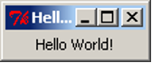

The first thing we notice is that the window already has the minimize, maximize and close buttons. tkInter creates these automatically for us. We also notice that the window can be resized as normal so we can make it look as follows.

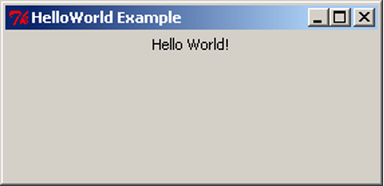

Note that when we resize the window to make it bigger the label will centre itself horizontally but stay at the top of the window. This is the default positioning used by pack. Soon we will see how to use pack to get different positioning.

<div class="important">

#### Basic GUI Code
<div class="viz">

```python
import tkinter as tk

root = tk.Tk()

root.title('Title String')

var_1 = tk.Widget(parent_widget, [config_args])
var_1.pack([pack_args])
    .
    .
    .
var_n = tk.Widget(parent_widget, [config_args])
var_n.pack([pack_args])

root.mainloop()
```
</div>

This is the basic GUI code layout for `tkInter`. Here *`Widget`* is the type of widget that is to be created, *`parent_widget`* is the widget that the current widget is to be packed into, *`config_args`* allow optional configuration of the widget upon creation, and *`pack_args`* are used to arrange the widget inside its parent widget (we will have a look at these options soon). These arguments follow the form *`argument_name=argument_value`*.
</div>

## Layout
### Side

Having all the widgets of our GUI set to the top-centre of the screen, as in the previous example, is not particularly useful. This is especially true when we start getting many widgets and want more complex layouts. The **pack** method we used in the previous example has many optional arguments that allow us to place the widgets almost wherever we want them.

Let’s have a look at some simple packing examples that will place Label widgets at different edges of the screen.

<div class="viz">

```python
import tkinter as tk

root = tk.Tk()

root.title("Packing")

right = tk.Label(root, text="I want to sit to the right", bg="light blue")
right.pack(side=tk.RIGHT)

left = tk.Label(root, text = "It's to the left for me", bg="green")
left.pack(side=tk.LEFT)

bottom = tk.Label(root, text="I want to lie on the bottom", bg="red")
bottom.pack(side=tk.BOTTOM)

bottom2 = tk.Label(root, text="I also want to lie on the bottom", bg="pink")
bottom2.pack(side=tk.BOTTOM)

root.mainloop()
```
</div>

This code is very similar to our Hello World example before but we have three labels instead of one. We have also added an extra argument to the Label, `bg`, which is short for background; it sets the background colour of the widget to the colour specified in the given string.

This colour string can be in words, as long as the colour is in the list of possible colours. Alternatively, we can specify the **RGB value** of the colour, which represents the amount of red, green and blue in the colour. This is done with a hash (`#`) followed by six **hexadecimal** digits. A hexadecimal number is a number in base 16 rather than base 10 (decimal numbers). Because hexadecimal numbers are base 16 we need hexadecimal digits for the numbers `10,11,12,13,14,15`. These are, respectively, `a,b,c,d,e,f`. So, the hexadecimal number `ff` is the (decimal) number 255 – i.e. `15*16+15`. In a hexadecimal number representing a colour, the first two digits represent the red component, the next two the green component, and the last two the blue component. So `#ffffff` is maximum red, green and blue – i.e. white and, conversely, `#000000` is black.

Also notice that there is now an optional argument inside the `pack` method calls. This is the **`side`** argument, which tells the widget to sit towards the edge of the given direction (`TOP`, `BOTTOM`, `LEFT`, `RIGHT`). Also notice that the side names are in all caps. This is because these are constants in the `tkInter` library.

<div class="aside">

#### Aside: Colour Options 
The list of possible named colours for Tk can be found at [](http://www.science.smith.edu/dftwiki/images/3/3d/TkInterColorCharts.png)
</div>

After saving the code to `pack_side.py`, we can test have a look at the result.

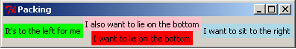

Notice how the widgets are tightly packed. Tk will keep the window to a size that just fits in all the widgets. Let’s experiment with expanding the window.

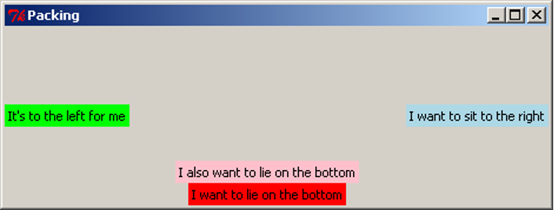

Notice the positioning of the widgets. Using `side` places widgets into four quadrants of the window. Widgets are also arranged in the order they are packed: the red label was packed before the pink one, so the red one was placed on the bottom before the pink one. Also notice that the background colour only fills up the area of the text in the Label widget, and the remainder of the window is the unused grey background. When the window expands, `tkInter` allocates more space for the widgets to sit in. Because the widgets don't change size, they sit in the centre, and the extra space is filled in with grey background. The image above has been digitally altered and reproduced below, with black boxes indicating the space which is allocated for that widget to occupy. Because the blue and green labels were packed first, the red and pink labels do not get the entire width of the window, only what was remaining when they were packed.

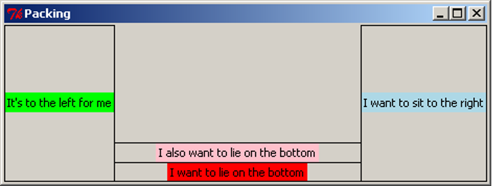

### Anchor

When the window expands, each of the widgets is left in the centre of its allocated space. The pack option `anchor` can be used to specify the direction the widget will sit when the widget is given more space. The `anchor` argument uses the compass system, valid arguments are `N`, `E`, `S`, `W`, `NE`, `SE`, `SW`, `NW`, `CENTER` (note the American spelling). Here is an example of widgets arranged using `anchor`:

<div class="viz">

```python
import tkinter as tk

root = tk.Tk()

root.title("Packing")

right = tk.Label(root, text="I want to sit to the right", bg="light blue")
right.pack(side=tk.TOP, anchor=tk.E)

left = tk.Label(root, text = "It's to the left for me", bg="green")
left.pack(side=tk.TOP, anchor=tk.W)

bottom = tk.Label(root, text="I want to lie on the bottom", bg="red")
bottom.pack(side=tk.TOP, anchor=tk.S)

root.mainloop()
```
</div>

We save our code to `pack_anchor.py` and have a look at the result.

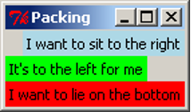

We have packed all the labels with the argument `side=TOP`, so they appear stacked from top to bottom in the order they were packed. If the `side` argument is not given, it defaults to `TOP`, so we could have left it out of the packing arguments, but we have included it as an explicit reminder that we want the labels to be arranged top-to-bottom. Let’s expand the window and see what it looks like.

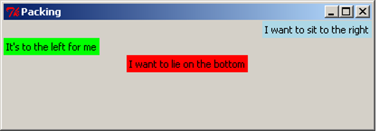

Notice how the widgets have moved left and right but not changed the vertical position. `anchor` has "pinned" the widgets in the direction specified. For clarity, we again digitally modify this image to show the space that each widget has been given. Notice that the red label has been anchored to the south side, but because it consumes all its allocated space vertically, we cannot observe any difference.

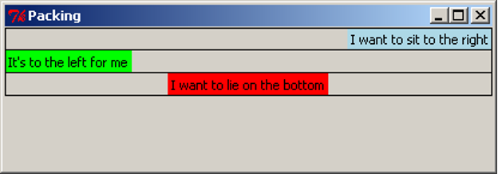

### Expand

We have already observed that `tkInter` allocates the minimal space needed to contain the widget, even when the window is resized. The **`expand`** packing option allows widgets to be allocated as much space as possible when the window is resized. The following example (`pack_expand.py`) makes use of this option.

<div class="viz">

```python
import tkinter as tk

root = tk.Tk()

root.title("Packing")

right = tk.Label(root, text="I want to sit to the right", bg="light blue")
right.pack(side=tk.RIGHT)

left = tk.Label(root, text = "It's to the left for me", bg="green")
left.pack(side=tk.LEFT, expand=True)

bottom = tk.Label(root, text="I want to lie on the bottom", bg="red")
bottom.pack(side=tk.BOTTOM)

bottom2 = tk.Label(root, text="I also want to lie on the bottom", bg="pink")
bottom2.pack(side=tk.BOTTOM)

root.mainloop()
```
</div>

This is equivalent to the first example, but the `left` label is packed with the argument `expand=True`. By default, `expand` is `False`, so for simplicity, we leave it out when it is not required. When we resize the window, we see this:

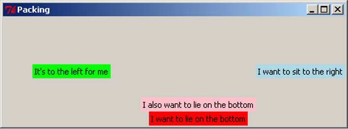

 
With digital modifications to the image above, we show that the space allocated around the green label expands in both directions when the window is resized, while the red and pink labels do not gain any more space. We can also clearly see that the green label has been anchored to the centre.

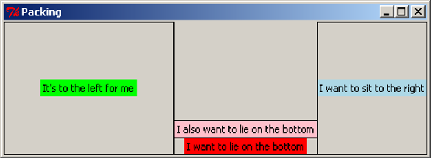

When multiple widgets have the `expand=True` option, they all expand equally. For example, if this option were turned on for the pink and red labels, resizing the window vertically would give each one the same amount of extra space (equivalent to half the distance the window is resized). This will be demonstrated in the section below.

### Fill
When we resize the window, the widgets themselves stay the same size, but `tkInter` allocates more space to surround the widgets, based on their `anchor` and `expand` values. The **`fill`** option specifies whether the widget should grow to fill the space allocated for it. Valid arguments are `X`, `Y`, `BOTH`, `NONE`, which represent filling in the horizontal (`X`) and vertical (`Y`) dimensions, both dimensions, or neither (which is the default option). The following example is similar to previous examples, and makes use of the `fill` parameter:

<div class="viz">

```python
import tkinter as tk

root = tk.Tk()

root.title("Packing")

right = tk.Label(root, text="I want to sit to the right", bg="light blue")
right.pack(side=tk.RIGHT, fill=tk.X)

left = tk.Label(root, text = "It's to the left for me", bg="green")
left.pack(side=tk.LEFT, fill=tk.Y)

bottom = tk.Label(root, text="I want to lie on the bottom", bg="red")
bottom.pack(side=tk.BOTTOM, expand=True, fill=tk.BOTH)

bottom2 = tk.Label(root, text="I also want to lie on the bottom", bg="pink")
bottom2.pack(side=tk.BOTTOM, expand=True, fill=tk.Y)

root.mainloop()
```
</div>

This code can be downloaded as `pack_fill.py`. When we run this code and resize the window, we get this result:

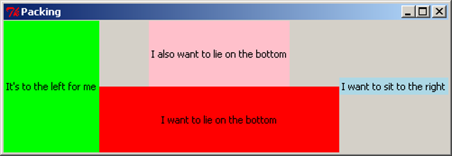

As with the previous examples, we add black borders to show the space allocated around each widget:

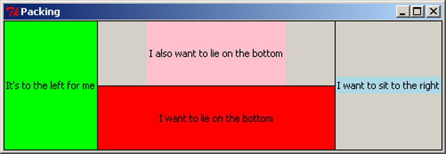

Note that the pink and red labels have been expanded, and together they now occupy the full height of the screen. The red label has been filled in both dimensions, taking up the entire space it can use. The pink label has been filled vertically, so it uses the full height available to it, but there is still grey background to the left and right of it. The green label has also been filled vertically, but because it does not expand horizontally, it appears to fill its entire space. The blue label has been filled in the `X` dimension, but because the label does not expand, this has no effect.

### Padding

For finer control of the size and spacing of widgets, we can use the padding options, `padx`, `pady`, `ipadx`, `ipady`, which allow us to specify an amount of space to include around the widget, on the inside and outside of the widget (specified as a number of pixels). The following example demonstrates the use of these options.

<div class="viz">

```python
import tkinter as tk

root = tk.Tk()

root.title("Packing")

right = tk.Label(root, text="I want space to the side", bg="light blue")
right.pack(side=tk.TOP, padx=30)

left = tk.Label(root, text = "I am very wide", bg="green")
left.pack(side=tk.TOP, ipadx=30)

bottom = tk.Label(root, text="I want space above and below", bg="red")
bottom.pack(side=tk.TOP, pady=30)

bottom2 = tk.Label(root, text="I am very tall", bg="pink")
bottom2.pack(side=tk.TOP, ipady=30)

root.mainloop()
```
</div>

This is available to download as `pack_pad.py`. When we run this code, we get the result shown in the first image below. The second image has been modified to include borders around the labels, shown in purple.

<!-- <div style="text-align:center">


</div> -->

<p align="center">

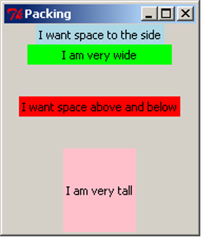
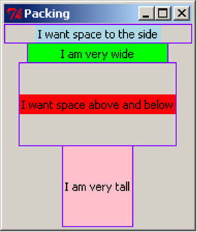
</p>

The `padx` adds space to the left and right of the label, shown by the blue label. If any widgets were to be added to the sides of this label, or if the blue label were to be resized, this space would remain the same. Similarly, the `pady` inserts padding above and below the red label, and the other labels are moved to accommodate the extra space. The `ipadx` and `ipady` options insert padding around the widget, but on the inside of the widget, which makes the labels appear larger, as shown with the green and pink labels.

<div class="important">

#### Packing Options
The `pack` method of tkInter widgets supports the following optional arguments, which affect how the widgets are arranged and displayed on the screen:

| Option                                   | Description                                                  |
| ---------------------------------------- | ------------------------------------------------------------ |
| **`side`**                                 | Specify which edge to pack this widget against. Can be `TOP`, `BOTTOM`, `LEFT` or `RIGHT` (if not specified, defaults to `TOP`). Multiple widgets can be packed on the same side to appear next to each other. |
| **`anchor`**                               | Specify where to position this widget, inside the space which  is allocated for it. Can be `N`, `NE`, `E`, `SE`, `S`, `SW`, `W`, `NW` or `CENTER` (defaults to `CENTER`). |
| **`expand`**                               | Specify (with a boolean value) if the space allocated around the widget should grow and shrink as the window is resized. Note that without the `fill` option, the widget itself will not be resized, but there will be more space around it. |
| **`fill`**                                 | Specify if the widget should fill in the space allocated around it, in one or both of the `x` and `y` dimensions. Can be `BOTH`, `X`, `Y` or `NONE` (defaults to `NONE`). When used with `expand=`True, the widget will grow when the window is resized; this is useful for widgets which should always take up as much of the screen as possible, such as the main view area of the application. |
| **`padx`**, **`pady`**, **`ipadx`**, **`ipady`** | Specify the amount of space to place inside or around this widget, in pixels. `padx` and `pady` will place a certain amount of background space around the widget. `ipadx` and `ipady` will add space inside the widget, making it larger. |

Experimenting with different combinations of packing order, and different combinations of `side`, `anchor`, `expand`, `fill`, and the `pad` options, will assist in understanding the behaviour of these settings.
</div>

## Frames

The `pack` options, `side` and `anchor`, only have limited capability for layout. To give us many more options we use a widget called **`Frame`**. The `Frame` widget is a blank widget used for simply containing widgets. This is very useful for creating simple through to complex GUI layouts as it can give us the ability to partition widgets into groups and position each group.

In the next section, we are going to build a simple game which involves moving a circle around the screen. We will have four buttons to represent up/down/left/right controls, and a blank "game screen" area which will show the movement of the circle. For now, we will investigate the layout of the GUI, using Labels. Shortly, we will replace these labels with other kinds of widgets.

<div class="viz">

```python
import tkinter as tk

root = tk.Tk()
root.title("Look what we can do with frames")

# "Button" labels

controls = tk.Frame(root)

up = tk.Label(controls, text="UP")
up.pack(side=tk.TOP)

left = tk.Label(controls, text="LEFT")
left.pack(side=tk.LEFT)

down = tk.Label(controls, text="DOWN")
down.pack(side=tk.LEFT)

right = tk.Label(controls, text="RIGHT")
right.pack(side=tk.LEFT)

controls.pack(side=tk.LEFT)

# screen Label

screen = tk.Label(root, text="screen", bg="light blue", width=38, height=16)
screen.pack(side=tk.LEFT, expand=True, fill=tk.BOTH)

root.mainloop()
```
</div>

Similar to the `Label`, the arguments to the `Frame` constructor are the parent widget (in this case, `root`), and any configuration options.

The code for the Labels is still mostly the same as we have seen before. The biggest difference is the parent widget is no longer `root`. For the "buttons" we have given the parent as `controls`. This makes the labels get packed into the `controls Frame`. For the `screen` label, we set a width and height to make it fairly large and square. Experimenting with different values for `width` and `height` will eventually give an acceptable size. We also set the screen to expand and fill when the window changes size.

Let’s now save our code to `frame_game.py` and see what we have created. For clarity, we also show a digitally altered image indicating the borders of the labels (in green) and the frame (in red).

<p align="center">

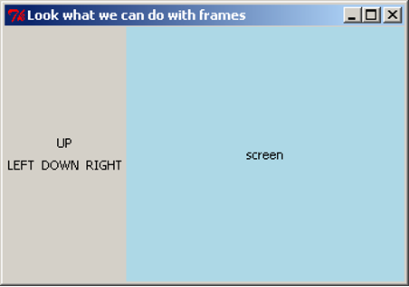
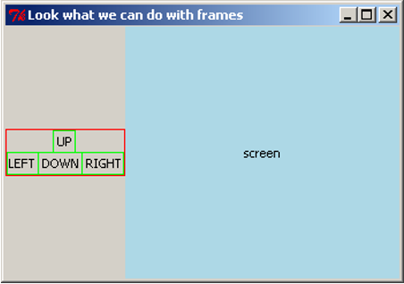
</p>

The four control labels have been arranged within the frame as if they were arranged in their own window. The frame can then be placed within the window, and all four buttons will stay grouped together. If this layout was attempted using the `side` and `anchor` options alone, it would be very difficult.

## Buttons

Having `Labels` representing buttons does not have much point. Let’s now introduce the real thing, the **`Button`** widget. We now rewrite our code from above using the `Button` widget instead of `Label` widgets. We also want the buttons to appear the same size, so we will set a width for each one. Because all four should have the same width, we will store the width value as a constant, `BUTTON_WIDTH`, to ensure we are always using the same width.

<div class="viz">

```python
import tkinter as tk

BUTTON_WIDTH = 10

root = tk.Tk()
root.title("Buttons are good")

# Buttons
controls = tk.Frame(root)

up = tk.Button(controls, text="UP", width=BUTTON_WIDTH)
up.pack(side=tk.TOP)

left = tk.Button(controls, text="LEFT", width=BUTTON_WIDTH)
left.pack(side=tk.LEFT)

down = tk.Button(controls, text="DOWN", width=BUTTON_WIDTH)
down.pack(side=tk.LEFT)

right = tk.Button(controls, text="RIGHT", width=BUTTON_WIDTH)
right.pack(side=tk.RIGHT)

controls.pack(side=tk.LEFT)

# screen Label

screen = tk.Label(root, text="screen", bg="light blue", width=38, height=16)
screen.pack(side=tk.LEFT, expand=True, fill=tk.BOTH)

root.mainloop()
```
</div>

Creating the `Button` widgets is again rather simple as they use similar arguments to other widgets we have used. Let’s now save our code as `game_screen.py` and have a look at our new GUI.

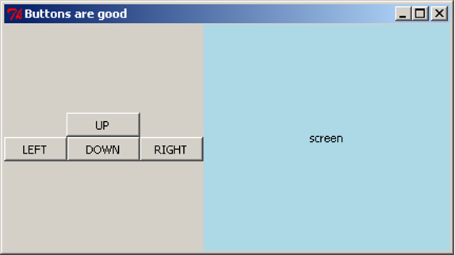

### Making Buttons Work
We would like to add functionality to our buttons, so that pressing the button will execute a task. We do this by writing a function that `tkInter` can call when the button is pressed. When we create the `Button`, we tell it what function to use through the `command` argument. For now, we will get the buttons to simply print to the console. We write four functions, one for each button:
<div class="viz">

```python
import tkinter as tk

BUTTON_WIDTH = 10

root = tk.Tk()
root.title("Buttons are good")

# Functions for the buttons to call

def push_up():
    print("UP")

def push_down():
    print("DOWN")

def push_left():
    print("LEFT")

def push_right():
    print("RIGHT")

# Buttons

controls = tk.Frame(root)

up = tk.Button(controls, text="UP", width=BUTTON_WIDTH, command=push_up)
up.pack(side=tk.TOP)

left = tk.Button(controls, text="LEFT", width=BUTTON_WIDTH, command=push_left)
left.pack(side=tk.LEFT)

down = tk.Button(controls, text="DOWN", width=BUTTON_WIDTH, command=push_down)
down.pack(side=tk.LEFT)

right = tk.Button(controls, text="RIGHT", width=BUTTON_WIDTH, command=push_right)
right.pack(side=tk.LEFT)

controls.pack(side=tk.LEFT)

# screen Label

screen = tk.Label(root, text="screen", bg="light blue", width=38, height=16)
screen.pack(side=tk.LEFT, expand=True, fill=tk.BOTH)

root.mainloop()
```
</div>

The **`command`** argument takes a function, which is called when the button is pressed. We do not want to execute the function, we want to take the function itself and give it to the `Button`. To do this, **we do not place parentheses after the function name**. By passing the function itself to the `Button`, we give the `Button` the ability to call the function at any time (in particular, whenever the button is pressed). In this situation, the function is known as a **callback** function, because we give the `Button` the ability to call back to a function in the application code.

This code is available as `game_screen1.py`. Each time we press a button it prints out to the console.

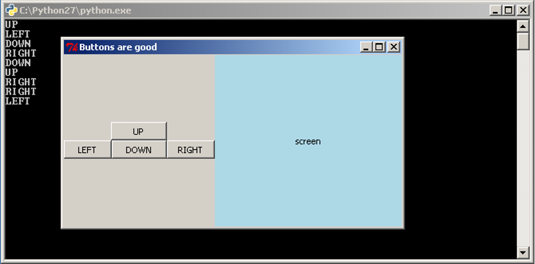

## The Entry Widget
We have seen how to interact with the user through buttons, but what about other methods, such as text? `tkInter` has a widget for this called the **`Entry`** widget. The `entry` widget is a small box that the user can enter text into.

We will start with a simple application that evaluates an expression and prints the result to the console. We will require a `Label` to label our `Entry` widget, the `Entry` widget, and a `Button` to evaluate the expression. The code is as follows:

<div class="viz">

```python
import tkinter as tk

root = tk.Tk()

root.title('Expression Evaluator')

label = tk.Label(root, text='Enter Expression: ')
label.pack(side=tk.LEFT)

entry = tk.Entry(root, width=20)
entry.pack(side=tk.LEFT)

def evaluate():
    expression = entry.get()
    try:
        result = eval(expression)
        print("The Result is: {0}".format(result))
    except Exception as e:
        print("An error occurred: {0}".format(e))

calc = tk.Button(root, text="Evaluate", command=evaluate)
calc.pack(side=tk.LEFT)

root.mainloop()
```
</div>

The second widget we create is the `Entry` widget. We have also used the optional argument `width` to specify that we want the text area to be 20 characters wide. We then wrote the `evaluate` function to take the input and print the result. In the first line we used the `get` method of the `Entry` widget. This method returns what is in the text area as a string. In this case it is our expression. The next line uses Python’s `eval` function. `eval` takes a string representing a Python expression and evaluates it, returning the result.

<div class="viz">

```python
>>> eval("2+5*4")
22
```
</div>

It is possible that the user has entered an invalid expression or an expression that will raise an exception, so we place a `try-except` statement around it to print out the error message. The last thing the evaluate function does is print out the result with a message. Let’s save our code as `simple_evaluator.py` and test it.

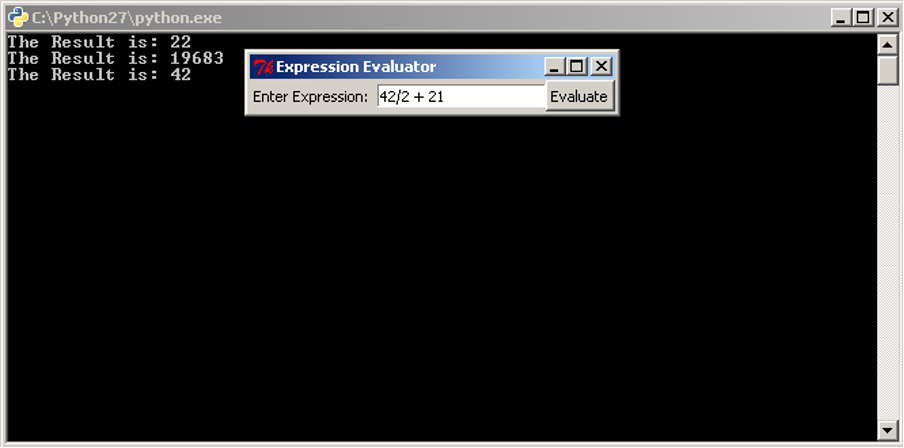

It would be good, however, to be able to do more than just print to the console.

## Changing Widgets

All widgets also have a method that allows us to change the way a widget looks. This method is the **`config`** method. It has the same optional arguments as the constructor of the widget. Let's extend our code so that instead of printing the result to the console, it changes the text in a `Label` so that the result is in the application itself. If there is an error message to show, we will also change the background colour to red. To make this work, we must also change the background colour back to grey when we are showing a result, otherwise the label would stay red after an error message is shown.

<div class="viz">

```python
import tkinter as tk

root = tk.Tk()

root.title('Expression Evaluator')

label = tk.Label(root, text='Enter Expression: ')
label.pack(side=tk.LEFT)

entry = tk.Entry(root, width=20)
entry.pack(side=tk.LEFT)

def evaluate():
    expression = entry.get()
    try:
        result = eval(expression)
        answer.config(text="The Result is: {0}".format(result), bg="grey")
    except Exception as e:
        answer.config(text="An error occurred: {0}".format(e), bg="red")

calc = tk.Button(root, text="Evaluate", command=evaluate)
calc.pack(side=tk.LEFT)

answer = tk.Label(root, text="", bg="grey")
answer.pack(side=tk.LEFT)

root.mainloop()
```
</div>

This code is almost the same, we have just added a new `Label` and changed the last line in the `evaluate` function. The change to the last line calls `config` on our new `Label`, `answer` and sets the text to the result.

Now saving our code as `simple_evaluator_nc.py`, we can have a look at our new application.


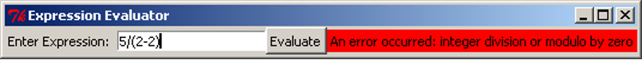

When an error message is shown, the label will keep the error message visible until a new expression is entered. This may be discomforting for the user, so we consider ways to fix this issue. One option would be to add a second button that resets the label back to grey and clears the message. It is also possible to reset the label whenever the user resumes typing in the `Entry` box.

So far we have covered a lot of different GUI widgets and aspects of creating GUIs. Yet we have been writing our code in a rather linear fashion. In the remainder of this section, and in the next section, we will look at restructuring our GUI programs using classes. This is to make the source code easier to read and maintain.

## GUI Design Using Classes

Classes can be used to simplify our GUI code, especially as the GUI and program gets more complex. We are going to rewrite our expression evaluator using a class. The code is below:

<div class="viz">

```python
import tkinter as tk

class EvalApp(object):
    """Simple application to allow a user to enter an expression and evaluate it.
    """

    def __init__(self, master):
        """Initialise the expression evaluator's application window.

        Parameters:
            master (Tk): Main window for application.
        """
        self._master = master
        master.title('Expression Evaluator')
        self._num = 0.0

        expressionLbl = tk.Label(master, text='Enter Expression: ')
        expressionLbl.pack(side=tk.LEFT)

        self._entry = tk.Entry(master, width=20)
        self._entry.pack(side=tk.LEFT)
        self._entry.insert(tk.END, str(self.num))

        evalBtn = tk.Button(master, text="Evaluate", command=self.evaluate)
        evalBtn.pack(side=tk.LEFT)

        self._result = tk.Label(master, text="", bg="grey")
        self._result.pack(side=tk.LEFT, padx=20)

    def evaluate(self):
        """Evaluates the expression in the Entry widget and 
           displays the result in the result Label.
        """
        try:
            self._num = eval(self._entry.get())
            self._result.config(text="The Result is: {0}".format(self._num),
                                bg="grey")
        except Exception as e:
            self._result.config(text="An error occurred: {0}".format(e), bg="red")

root = tk.Tk()
app = EvalApp(root)
root.mainloop()
```
</div>

The most noticeable change is the order of the code, the class needs to be written first so that the class is defined before we try to use it. The next thing to notice is the use of **`master`** as a parameter in the class’ constructor, and as the parent class for the widgets. `master` is used by convention to signify the "highest level" class. `master` is passed the value of `Tk` when the `EvalApp` object is created. We have added a `self._num` instance variable as well, this is the same as the result variable we used before, we also use it when creating the `Entry` widget to give our application a slightly more professional look. The first widget we create is a `Label`, but we do not assign it as an instance variable. As we just want this widget to display and not access it later, we do not need to store it in the class structure. We do the same for the `Button` widget.

When we create the `Entry` widget this time we also use the **`insert`** method. `insert` inserts a string into the `Entry` widget at a location, in this case the string of `self._num` at the end of any text in there. The rest of the class is mostly the same code we had before.

After the class definition we have the `Tk` code. In this case we only need three lines because our class does all the work. The first and last line we already know. The middle line creates an instance of our class passing `root` into the constructor. As `root` is an instance of `Tk`, we are passing in a `Tk` object.

We can now save our code as `evaluator_class.py` and have a look.


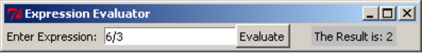

Apart from the small changes to the GUI that we made it looks and works exactly the same as what we had before.