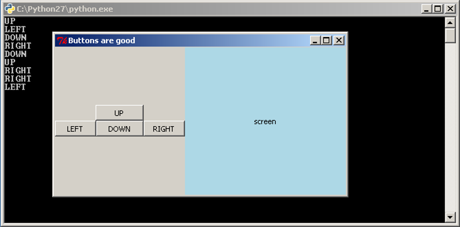
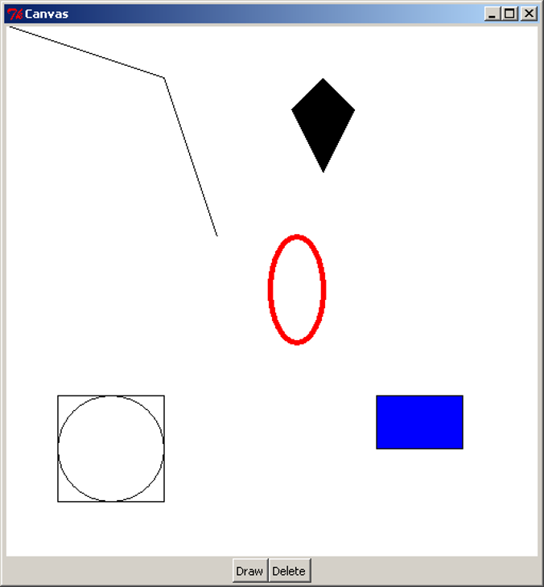
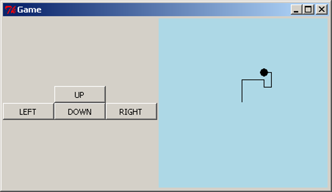
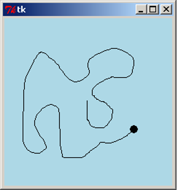
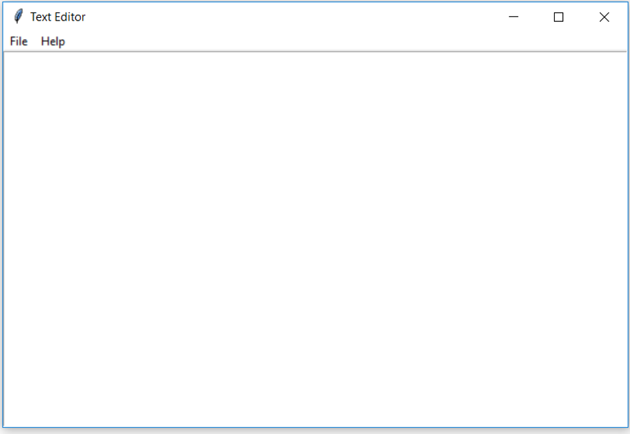

> <p> Three people have just fallen past that window</p>
{: .blockquote}

# Graphical User Interfaces – Part 2
## Structuring GUI Code

When writing GUI code, we often want to group widgets. This typically happens when we want these widgets to appear together in our GUI and/or when these widgets, as a group, have a role in the program. We can think of this as creating our own widget. We will take our game screen example from the previous section as an example. The four directional buttons could be grouped together into a single "controls" widget that can be dealt with separately. To do this, we will write a class that inherits from `Frame` and contains our directional buttons.

<div class="viz">

```python
import tkinter as tk

class Controls(tk.Frame):
    """Widget containing four directional buttons."""

    BUTTON_WIDTH = 10

    def __init__(self, parent):
        """Set up the four directional buttons in the frame.

        Parameters:
            parent (Tk): Window in which this widget is to be placed.
        """
        super().__init__(parent)

        upBtn = tk.Button(self, text="UP", width=self.BUTTON_WIDTH,
                          command=self.push_up)
        upBtn.pack(side=tk.TOP)
        leftBtn = tk.Button(self, text="LEFT", width=self.BUTTON_WIDTH,
                            command=self.push_left)
        leftBtn.pack(side=tk.LEFT)
        downBtn = tk.Button(self, text="DOWN", width=self.BUTTON_WIDTH,
                            command=self.push_down)
        downBtn.pack(side=tk.LEFT)
        rightBtn = tk.Button(self, text="RIGHT", width=self.BUTTON_WIDTH,
                             command=self.push_right)
        rightBtn.pack(side=tk.LEFT)

    def push_up(self):
        print("UP")

    def push_down(self):
        print("DOWN")

    def push_left(self):
        print("LEFT")

    def push_right(self):
        print("RIGHT")

class GameApp(object):
    """Basic game window design."""

    def __init__(self, master):
        """Initialise the game window layout
           with four directional buttons widget and a screen.

        Parameters:
            master (Tk): Main window for application.
        """
        master.title("Buttons are good")
        controls = Controls(master)
        controls.pack(side=tk.LEFT)
        screen = tk.Label(master, text="screen", bg="light blue", 
                          width=38, height=16)
        screen.pack(side=tk.LEFT, expand=True, fill=tk.BOTH)


root = tk.Tk()
app = GameApp(root)
root.mainloop()
```
</div>

The first class we wrote is our `Controls` class, to represent the directional buttons widget. This class inherits from `Frame`, so the `__init__` method calls `Super().__init__` with the argument **`parent`**. Conventionally `parent` is the name used for the widget that will contain this one, i.e. its parent. In this case, the `Controls` widget will be contained inside the root Tk object. We might consider another application where the `Controls` widget is packed inside a different container widget, such as another `Frame`.

The `__init__` method then creates our four buttons. Again, as we are not expecting to update or get information from our buttons we do not need to store them in class variables. We want to pack the buttons into the `Controls` instance (recall that `Controls` is just a specialisation of a `Frame`, so we can pack widgets into it). To do this, we set the parent widget of the buttons as `self`, the `Controls` object.

The `Controls` class contains four more methods, which are used as the callbacks for the buttons. By writing these methods in the `Controls` class, we make it clear that they will only be used by the four buttons contained in this widget. It also gives these methods access to any information in the `Controls` object, which might be necessary if the buttons needed to do more complex tasks.

In the `GameApp` class we now only need to create two widgets, our `Controls` widget and the `Label` widget. (Where we are using the `Label` to represent the game’s screen.)

We can now save our code as `game_screen_classes.py` and have a look.



Writing the code this way, where we group sets of related widgets into classes, makes the code look very simple, and it is. It is easy code to read, debug and modify, which is why this method is preferred.

As well as `Frame`, tkInter includes other blank container widgets to arrange widgets inside. The `Toplevel` widget represents a new blank window. This can be useful for creating dialog boxes within an application, by creating a class which inherits from `Toplevel`.

## The Canvas
We have already seen the `Label`, `Button` and `Entry` widgets and now we consider the `Canvas` widget. The `Canvas` widget represents a space for drawing objects on the screen, such as lines, ovals and polygons. The following example shows the use of some of the drawing methods available.

<div class="viz">

```python
import tkinter as tk

class CanvasApp(object):
    def __init__(self, master):
        master.title("Canvas")

        self._canvas = tk.Canvas(master, bg="white", width=500, height=500)
        self._canvas.pack(side=tk.TOP, expand=True, fill=tk.BOTH)

        frame = tk.Frame(master)
        drawBtn = tk.Button(frame, text="Draw", command=self.draw)
        drawBtn.pack(side=tk.LEFT)
        dltBtn = tk.Button(frame, text="Delete", command=self.delete)
        dltBtn.pack(side=tk.LEFT)
        frame.pack(side=tk.TOP)

    def draw(self):
        # Example 1
        self._canvas.create_line([(0, 0), (150, 50), (200, 200)])

        # Example 2
        self._canvas.create_polygon([(300, 50), (330, 80), (300, 140), (270, 80)])

        # Example 3
        self._canvas.create_oval(250, 200, 300, 300, outline="red", width=5)

        # Example 4
        self._canvas.create_rectangle(350, 350, 431, 400, fill="blue")

        # Example 5
        centre = (100, 400)
        radius = 50
        self._canvas.create_oval(centre[0]-radius, centre[1]-radius,
                                 centre[0]+radius, centre[1]+radius)
        self._canvas.create_rectangle(centre[0]-radius, centre[1]-radius,
                                      centre[0]+radius, centre[1]+radius)

    def delete(self):
        self._canvas.delete(tk.ALL)

root = tk.Tk()
app = CanvasApp(root)
root.mainloop()
```
</div>

This code is available as `canvas.py`. When we run the script, we see a blank white screen with two buttons. When we click on the "Draw" button, we see this result:



First, the `CanvasApp` creates and packs a `Canvas` with a white background, and a width and height of 500 pixels. Each of the drawing methods of the `Canvas` use a coordinate system in pixels, where `(0, 0)` is the top-left, the positive `x` direction is to the right, and the positive `y` direction is down the screen. Note that this is different from the standard Cartesian coordinate system where the positive `y` direction is up. The coordinates of the bottom-right corner of the canvas are the same as the width and height of the canvas.

Note, we did not create a separate widget for the two control buttons, `Draw` and `Delete`. As there are only two buttons, this example did not call for the creation of a new widget.

The first object drawn on the canvas is a line. The `create_line` method takes a sequence of x and y coordinates, and draws a straight line between each pair of coordinates. The example above shows a line drawn from `(0, 0)` in the top-left corner, through `(150, 50)`, ending at `(200, 200)`. `create_line` can also be used to draw a curve or freehand line, by drawing straight lines with many coordinates placed very close together. This does not make an exact curve, but it will appear very close to a curve when viewed on a monitor.

The second object drawn here is a polygon. Similar to drawing a line, it takes a sequence of coordinates. The polygon is then drawn with these coordinates as the vertices, and then the polygon is filled in (coloured black by default). This example shows a kite shape, drawn in the order of the coordinates specified. Note that unlike the `create_line` method, `create_polygon` will join the last pair of coordinates back to the first (which is necessary to draw a closed polygon).

Example 3 above draws a red oval. Here, we specify four coordinates, representing the leftmost `x`-coordinate, the uppermost `y`-coordinate, the rightmost `x`-coordinate, and the lowermost `y`-coordinate. Another way to visualise the drawing of the oval is to imagine a rectangle drawn around it, such as the square and circle arrangement in the above image. When drawing the oval, we specify the top-left and bottom-right corners of the surrounding rectangle, and the oval is drawn inside. Here, we also make use of two optional arguments, `outline` and `width`. Each of the `Canvas` "create" methods can accept optional arguments to specify other details, such as colour and line width. `outline` and `width` are used to specify the colour and width of the oval’s outline.

Example 4 draws a blue rectangle. To do this, we specify the coordinates of the top-left and bottom-right corners of the rectangle. Here we have also used another optional argument, `fill`, to specify the internal colour of the rectangle. By default, ovals and rectangles are transparent. Notice though that the rectangle still has a black border, but it can be hard to spot, because it is only one pixel wide. To set the entire rectangle to the same colour, we would either set the `outline` to the same colour, or set the outline `width` to 0 to remove the outline entirely.

In the final example, we draw a circle by specifying a centre and radius, then using simple arithmetic to create an oval at the desired coordinates. We also draw a square at the same coordinates. If we were writing an application that involved drawing a lot of circles, we might consider writing a method that takes a pair of coordinates and a radius, and draws a circle centred at those coordinates. This would make the drawing part of the application much easier to write.

The `Canvas` has a `delete` method, which can be used to remove drawings from the screen. Clicking on the "Delete" button will call `self._canvas.delete(tk.ALL)`, which deletes all the drawings. Clicking on "Draw" will bring them back. Note that clicking on "Draw" multiple times will actually draw a complete set of new objects on the canvas each time, but because they all overlap, we only see one set of drawings.

## Customising Widgets
We will continue with the game example and replace the screen label with a `Canvas`. In doing this, we will need to think about the logic of the application. What will be the initial setup of the screen area? What information about the game will need to be stored in the program? How will user interactions change the internal state, and how do we show this change in the screen?

In this simple example, the game involves a circle shown on the screen, initially in the centre. Pressing the four buttons will move the circle around the screen, drawing lines behind it to form a path. To do this, the application will need to keep track of where the circle is, and all the coordinates of where it has been. When updating a figure or drawing on a `Canvas` widget, it can often be easiest to clear the entire canvas, then redraw everything from scratch.

Now that we have investigated the functionality required for the canvas, we realise that each of the buttons needs to take a number of steps to complete its task. Because this all seems to be the work of the `Canvas`, we will customise `Canvas` to have extra methods and attributes to fit our situation. That is, we will write a subclass of `Canvas` which has this functionality.

<div class="viz">

```python
class Screen(tk.Canvas):
    """A customised Canvas that can move a circle and draw a path."""
    SIZE = 230  # The size of the screen.
    RADIUS = 5  # The radius of the circle
    MOVE = 10   # The amount to move on each step

    def __init__(self, parent):
        """Create and initialise a screen.

        Parameters:
            parent (Tk): Window in which this screen is to be placed.
        """
        super().__init__(parent, bg="light blue", width=self.SIZE,
                         height=self.SIZE)

        # Start in the centre, without any points in the path.
        self._x, self._y = (self.SIZE / 2, self.SIZE / 2)
        self._path = [(self._x, self._y)]
        self._redraw()

    def _redraw(self):
        """Redraw the game screen after a move."""
        self.delete(tk.ALL)
        coords = (self._x - self.RADIUS,
                  self._y - self.RADIUS,
                  self._x + self.RADIUS,
                  self._y + self.RADIUS)
        self.create_oval(coords, fill="black", width=0)
        if len(self._path) > 1:
            self.create_line(self._path)

    def _move(self, dx, dy):
        """Move the circle by a given amount. 

        Parameters:
            dx (int): Amount to move in the x-coordinate.
            dy (int): Amount to move in the y-coordinate.
        """
        self._x += dx
        self._y += dy
        self._path.append((self._x, self._y))
        self._redraw()

    def move_up(self):
        """Move the circle up."""
        self._move(0, -self.MOVE)

    def move_down(self):
        """Move the circle down."""
        self._move(0, self.MOVE)

    def move_left(self):
        """Move the circle left."""
        self._move(-self.MOVE, 0)

    def move_right(self):
        """Move the circle right."""
        self._move(self.MOVE, 0)
```
</div>

This `Screen` will store the current coordinates of the circle, and a list of coordinates it has been to. The private method `_redraw` will delete and redraw the circle and path on the screen, which is done at the beginning and after every movement. The methods `move_up`, `move_down`, `move_left` and `move_right` will perform the actions required by the four buttons. Note that, as `Screen` inherits from `Canvas`, it can make method calls such as `self.delete(tk.ALL)` and `self.create_oval` to draw on the canvas. We can now modify the `Controls` and `GameApp` classes to use a `Screen`:

<div class="viz">

```python
class Controls(tk.Frame):
    """Widget containing four directional buttons."""

    BUTTON_WIDTH = 10

    def __init__(self, parent):
        """Set up the four directional buttons in the frame.

        Parameters:
            parent (Tk): Window in which this widget is to be placed.
            screen (Screen): Screen which has the movement methods.
        """
        super().__init__(parent)

        upBtn = tk.Button(self, text="UP", width=self.BUTTON_WIDTH,
                          command=screen.move_up)
        upBtn.pack(side=tk.TOP)
        leftBtn = tk.Button(self, text="LEFT", width=self.BUTTON_WIDTH,
                            command=screen.move_left)
        leftBtn.pack(side=tk.LEFT)
        downBtn = tk.Button(self, text="DOWN", width=self.BUTTON_WIDTH,
                            command=screen.move_down)
        downBtn.pack(side=tk.LEFT)
        rightBtn = tk.Button(self, text="RIGHT", width=self.BUTTON_WIDTH,
                             command=screen.move_right)
        rightBtn.pack(side=tk.LEFT)


class GameApp(object):
    """Basic game window design."""

    def __init__(self, master):
        """Initialise the game window layout with
           four directional buttons and a screen.

        Parameters:
            master (Tk): Main window for application.
        """
        master.title("Game")
        screen = Screen(master)
        controls = Controls(master, screen)
        controls.pack(side=tk.LEFT)
        screen.pack(side=tk.LEFT, expand=True, fill=tk.BOTH)
```
</div>

The updated `Controls` class now also requires the `Screen` object, and it uses this to access the four methods needed as `Button` callbacks. The `GameApp` is also modified to create a `Screen` instead of a `Label`. This code is available to download as `game_canvas.py`. When we interact with this program, we see this result:



<div class="aside">

#### Aside: Separating the `Controls` and `Screen` 
The constructor of the `Controls` class above requires an object called `screen`, and it uses this to access `move_up`, `move_left`, `move_down` and `move_right`, which should be methods that perform the relevant actions. For this program, there is no problem, but what if we wanted to modify the program? There are several potential issues to watch out for.

If we modified (or replaced) the `Screen` and renamed the four movement methods, we would need to modify the code in `Controls`. Worse, if the methods were moved into separate classes, or made into top-level functions, we could no longer pass in a single object to `Controls` which can access all the methods. This is still not a major issue in an application this small, but in a larger application, many other classes could be dependent on the `Screen`, which would cause problems when we tried to change the `Screen`. We could also imagine a situation where multiple `Controls` widgets were needed, each requiring different method names.

To fix these issues, we can modify the `Controls` class to require the four callback functions directly; then the internals of `Controls` would still work, even if the methods were renamed or moved. We then have this result:

<div class="viz">

```python
class Controls(tk.Frame):
    BUTTON_WIDTH = 10
    def __init__(self, parent, up, down, left right):
        super().__init__(parent)
        upBtn = tk.Button(self, text="UP", width=self.BUTTON_WIDTH,
                          command=up)
        upBtn.pack(side=tk.TOP)
        leftBtn = tk.Button(self, text="LEFT", width=self.BUTTON_WIDTH,
                            command=left)
        leftBtn.pack(side=tk.LEFT)
        downBtn = tk.Button(self, text="DOWN", width=self.BUTTON_WIDTH,
                            command=down)
        downBtn.pack(side=tk.LEFT)
        rightBtn = Button(self, text="RIGHT", width=self.BUTTON_WIDTH,
                          command=right)
        rightBtn.pack(side=tk.LEFT)


class GameApp(object):
    def __init__(self, master):
        master.title("Game")
        screen = Screen(master)
        controls = Controls(master, screen.move_up, screen.move_down,
                                    screen.move_left, screen.move_right)
        controls.pack(side=tk.LEFT)
        screen.pack(side=tk.LEFT, expand=True, fill=tk.BOTH)
```
</div>

The `GameApp` is also modified to access the respective methods of `Screen`. In a sense, we have now completely separated the `Controls` and `Screen` classes, and the interaction between them is defined entirely by the `GameApp` class. In a larger application, moving all of this control to the one class will make it much easier to treat all the other classes as distinct from each other.

The implementation for this code is provided in `game_canvas_sep_controls.py`.
</div>

## Events
The program we wrote above feels difficult to use. In particular, the use of the four buttons is unintuitive. We would like the user to interact directly with the canvas using mouse gestures. `tkInter` provides a means of doing this using **events**. An event is a trigger which occurs when the user makes an action with the mouse or keyboard. For example, when the user makes a left click, `tkInter` will trigger a `<Button-1>` event, and when the user drags the mouse with a left click, `tkInter` will trigger a `<B1-Motion>` event. To use these types of event, we must `bind` the event to a callback function, similar to a callback function for a `Button`. Widgets have a method bind which takes an event name (as a string) and a callback function. The function must take one argument, typically called `event`, which contains information on the trigger that occurred. For example, if the mouse was clicked or moved, the `event` would contain the coordinates of the cursor.

As an example, we will modify the game screen example so that clicking and dragging will move the circle. We should again consider the application logic: what should happen when the mouse is pressed or released? What should happen when the pressed mouse is dragged slightly? If the mouse is pressed, we should look to see if we have clicked on the circle, and if so mark it as being "selected". When the mouse is dragged, we should see if the circle has been selected, and if so move it accordingly. When the mouse is released, then we mark the circle as "deselected".

<div class="viz">

```python
import tkinter as tk
import math

class Screen(tk.Canvas):
    ""Customised Canvas that can move a circle and draw a path."""
    SIZE = 230   # The size of the screen.
    RADIUS = 5   # The radius of the circle

    def __init__(self, parent):
        """Create and initialise a screen.

        Parameters:
            parent (Tk): Window in which this screen is to be placed.
        """
        super().__init__(parent, bg="light blue", width=self.SIZE,
                         height=self.SIZE)

        # Start in the centre, without any points in the path.
        self._x, self._y = (self.SIZE / 2, self.SIZE / 2)
        self._path = [(self._x, self._y)]

        self._circle_select = False   # Is the circle selected.
        self.bind("<Button-1>", self._click_event)
        self.bind("<B1-Motion>", self._move_event)

        self._redraw()


    def _redraw(self):
        """Redraw the game screen after a move."""
        self.delete(tk.ALL)
        coords = (self._x - self.RADIUS,
                  self._y - self.RADIUS,
                  self._x + self.RADIUS,
                  self._y + self.RADIUS)
        self.create_oval(coords, fill="black", width=0)
        if len(self._path) > 1:
            self.create_line(self._path)

    def _move(self, dx, dy):
        """Move the circle by a given amount. 

        Parameters:
            dx (int): Amount to move in the x-coordinate.
            dy (int): Amount to move in the y-coordinate.
        """
        self._x += dx
        self._y += dy
        self._path.append((self._x, self._y))
        self._redraw()

    def _click_event(self, event):
        """Sets whether the circle is selected.
        
        Parameters:
            event (tk.Event): Selection event with mouse coordinates.        
        """
        dist_to_circle = math.hypot(event.x - self._x, event.y - self._y)
        self._circle_select = (dist_to_circle < self.RADIUS)

    def _move_event(self, event):
        """Calculates the distance to move the circle so that it moves 
           With the mouse.
        
        Parameters:
            event (tk.Event): Drag event with the new mouse coordinates.
        """
        if self._circle_select:
            dx = event.x - self._x
            dy = event.y - self._y
            self._move(dx, dy)


class GameApp(object):
    """Basic game to move a circle around a screen with the mouse."""
    def __init__(self, master):
        """Initialise the game screen.

        Parameters:
            master (Tk): Main window for application.
        """
        screen = Screen(master)
        screen.pack(side=tk.LEFT, expand=True, fill=tk.BOTH)


root = tk.Tk()
app = GameApp(root)
root.mainloop()
```
</div>

We have removed the buttons as they are no longer needed, we will now have full control over the circle with the mouse. The first big change to notice is the addition of three new lines in the `Screen.__init__` method. The first line is simply a boolean value to tell if the circle is selected. The next two lines are calling the **`bind`** method. `bind` takes a string as the first argument for what type of event we are interested in. The second argument is the method to call when that event occurs. The two events we are interested in is **`Button-1`** (If the left mouse button is clicked) and **`B1-Motion`** (If the mouse is moved while the left mouse button is held down).

Next, we have removed the four move methods of `Screen` and replaced them with two new methods. These methods are the methods called by our two bound events. Notice how each takes an argument `event`. This argument is the event. It is a class of Python and contains information about the event that occurred. We can use `event` to access the x, y location of the mouse when the event occurred by accessing the class variable. The `_click_event` method sets `self._circle_select` to a boolean value representing whether or not the mouse is inside the circle. The `_move_event` method calculates the distance between where the circle is and where the mouse is so that we can move the circle to the mouse’s location.

We can now save our code as `game.py` and have a look at our new game.



We can now move the circle any way that we wish at any time just by simply moving the mouse.

<div class="aside">

#### More About Events
Here is a table of some of the events that can be used. (Sourced from [http://www.python-course.eu/tkinter_events_binds.php](http://www.python-course.eu/tkinter_events_binds.php))

| Events        | **Description**                                              |
| ------------- | ------------------------------------------------------------ |
| `<Button-1>`  | A mouse button is pressed over the widget. Button 1 is the leftmost button, button 2 is the middle button (where available), and button 3 the rightmost button. When a mouse button is pressed down over a widget, Tkinter will automatically "grab" the mouse pointer, and mouse events will then be sent to the current widget as long as the mouse button is held down. The current position of the mouse pointer (relative to the widget) is provided in the `x` and `y` members of the event object passed to the callback. |
| `<B1-Motion>` | The mouse is moved, with mouse button 1 being held down (use B2 for the middle button, B3 for the right button). The current position of the mouse pointer is provided in the `x` and `y` members of the event object passed to the callback. |
| `<Return>`    | The user pressed the Enter key. Virtually all keys on the keyboard can be bound to. For an ordinary 102-key PC-style keyboard, the special keys are **Cancel** (the Break key), **BackSpace**, **Tab**, **Return**(the Enter key), **Shift_L** (any Shift key), **Control_L** (any Control key), **Alt_L** (any Alt key), **Pause**, **Caps_Lock**, **Escape**, **Prior** (Page Up), **Next** (Page Down), **End**, **Home**, **Left**, **Up**, **Right**, **Down**, **Print**, **Insert**, **Delete**, **F1**, **F2**, **F3**, **F4**, **F5**, **F6**, **F7**, **F8**, **F9**, **F10**, **F11**, **F12**, **Num_Lock**, and **Scroll_Lock**. |
| `<Key>`       | The user pressed any key. The key  is provided in the `char` member of the event object passed  to the callback (this is an empty string for special keys). |
| `a`           | The user typed an "a".  Most printable characters can be used as is. The exceptions are space (`<space>`) and less than (`<less>`). Note that `1` is a keyboard binding, while `<1>` is a button binding. |
| `<Configure>` | The widget changed size (or  location, on some platforms). The new size is provided in the `width` and `height` attributes of the event object  passed to the callback. |

Some of the attributes of the `event` class

| Attribute          | Description                                                  |
| ------------------ | ------------------------------------------------------------ |
| `x`, `y`           | The current mouse position, in pixels.                       |
| `x_root`, `y_root` | The current mouse position relative to the upper left corner of the screen, in pixels. |
| `char`             | The character code (keyboard events only), as a string.      |
| `width`, `height`  | The new size of the widget, in pixels (Configure events only). |
| `type`             | The event type.                                              |
</div>

## More tkInter
In this example, we will create a simple text editor application. This text editor will be able to open, edit, save and close files. We will also keep track of whether the text file has been edited without saving, and prompt the user to save before exiting.

We will introduce a new widget, `Text`, to represent the text editing area. This widget has three methods which will be useful in this application: `text.get(1.0, tk.END)` will retrieve the text which has been entered into the widget, `text.delete(1.0, tk.END)` will remove all the text from the widget, and `text.insert(tk.END, string)` will insert a *`string`* of text into the widget. There are many other types of widgets not described here, to represent other GUI elements, such as lists of elements, scroll bars, check boxes, and radio buttons. Each has its own set of methods which are useful in manipulating the information that type of widget stores.

To open and save files, we will use the tkInter `filedialog` module. This module is imported using the other type of `import` that is performed as follows: `from module import submodule_or_class` This comes with two methods, `askopenfilename` for choosing a file to open, and `asksaveasfilename` for choosing a file to save to. These functions will open a dialog box prompting the user to choose a file, and then return the file name. The appearance of the dialog boxes is determined by the operating system (that is, it is a **native** dialog box), so the user will already be familiar with using the dialog without requiring effort from the programmer.

We will also need to display short dialog message boxes. When the user tries to abandon a file without saving changes, we will prompt them to save. We will add this functionality to an "Exit" menu item, as well as when the user closes the window using the "X" button on the top of the window. We will also create a simple "About" dialog box, giving information about the text editor when the user asks for it. These dialog boxes will be **modal**; this means that the user will not be able to continue using the application until they respond to the dialog. We will use tkInter’s `messagebox` module. This comes with several functions for showing different types of dialog such as errors, warnings, "Yes/No" or "Retry/Cancel" questions. They can be customised to show different titles, messages, icons and buttons, and will return a value based on the user's button choice.

We will also introduce the `Menu` widget, for adding the native menus on the top of the window. To make a set of menus, we create a `Menu` object to represent the menu bar. We then add more `Menu` objects to represent each of the drop-down menus. To add individual menu items, we give them a label and assign a callback `command`, just as we create callbacks for buttons.

We will now write the text editor application. As well as constructing the GUI, we will need to store the filename of the document being edited. We will also store a boolean flag indicating whether or not the file has been edited without saving. When we attempt to close the file or open a new one, we will check to see if the user wishes to save their work.

<div class="viz">

```python
import tkinter as tk
from tkinter import filedialog
from tkinter import messagebox


class TextEditor(object) :
    """Simple text editing application."""

    def __init__(self, master) :
        """ Create the screen for the text editor

        Parameters:
            master (Tk): Window in which this application is to be displayed.        
        """
        self._master = master
        master.title("Text Editor")

        self._filename = ''
        self._is_edited = False

        self._text = tk.Text(master)
        self._text.pack(side=tk.TOP, expand=True, fill=tk.BOTH)
        self._text.bind("<Key>", self._set_edited)

        # Create the menu.
        menubar = tk.Menu(master)
        master.config(menu=menubar)

        filemenu = tk.Menu(menubar)
        menubar.add_cascade(label="File", menu=filemenu)
        filemenu.add_command(label="New", command=self.new)
        filemenu.add_command(label="Open", command=self.open_file)
        filemenu.add_command(label="Save", command=self.save)
        filemenu.add_command(label="Save As...", command=self.save_as)
        filemenu.add_command(label="Exit", command=self.close)

        helpmenu = tk.Menu(menubar)
        menubar.add_cascade(label="Help", menu=helpmenu)
        helpmenu.add_command(label="About", command=self.about)

        master.protocol("WM_DELETE_WINDOW", self.close)


    def new(self) :
        """Create a new text file."""
        if self._can_close() :
            # Forget about the currently open file.
            self._text.delete(1.0, tk.END)
            self._filename = ''
            self._master.title("Text Editor")
            self._is_edited = False


    def open_file(self) :
        """Open a text file."""
        if not self._can_close() :
            return

        self._filename = filedialog.askopenfilename()
        if self._filename :
            f = open(self._filename, "r")
            text = f.read()
            f.close()

            self._text.delete(1.0, tk.END)
            self._text.insert(tk.END, text)
            self._master.title("Text Editor: {0}".format(self._filename))
            self._is_edited = False


    def save(self) :
        """ Save the contents of the text in memory to the file."""
        if not self._filename :
            self._filename = filedialog.asksaveasfilename()
        self._perform_save()


    def save_as(self) :
        """ Allow saving the contents of the text in memory to a new file."""
        filename = filedialog.asksaveasfilename()
        if filename :
            self._filename = filename
        self._perform_save()


    def close(self) :
        """Exit the text editor application."""
        if self._can_close() :
            self._master.destroy()


    def about(self) :
        """Generate an 'About' dialog."""
        messagebox.showinfo(title="Text Editor", message="A simple text editor")


    def _set_edited(self, event) :
        """Record that the text file has been edited.
        
        Parameters:
            event (Tk.Event): Record that text has been edited if any event
                              occurs in the text.
        """
        self._is_edited = True


    def _perform_save(self)  :
        """Store the contents in memory into a file."""
        if self._filename:
            self._master.title("Text Editor: {0}".format(self._filename))
            f = open(self._filename, "w")
            text = self._text.get(1.0, tk.END)[:-1]
            f.write(text)
            f.close()
            self._is_edited = False


    def _can_close(self) :
        """ Ask the user if they want to save the changed text to a file. 	
        Returns:
            (bool) True if it is safe to close the file;
                   False if the user wants to continue editing.
        """
        can_close = True
        if self._is_edited :
            reply = messagebox.askquestion(type=messagebox.YESNOCANCEL,
                        title="File not saved!",
                        message="Would you like to save this file?")
            if reply == messagebox.YES :
                self.save()   # can_close is already True.
            # elif reply == messagebox.NO :
                # can_close is already True.
            elif reply == messagebox.CANCEL :
                can_close = False
        # else file is not edited, so can close.
        return can_close


if __name__ == "__main__" :
    root = tk.Tk()
    TextEditor(root)
    root.mainloop()
```
</div>

First, we will look at the `__init__` method. We create and pack a `Text`, and bind the `"<Key>"` event to a method which will set the `_is_edited` flag to True whenever a key is pressed. The statement `menubar = tk.Menu(master)` will create a menu bar for the `master` window, and in the line below, we configure the `master` to display this menu bar. To create menus, `tk.Menu(menubar)` will create an empty menu list, and `menubar.add_cascade` will insert it onto the menu bar with the given text label. To add a menu item, we use the method `add_command`, and pass in a text label to display, and a callback function, just as with `Button` objects. If, for example, we wanted to create a sub-menu to the "File" menu, we would create `tk.Menu(filemenu)` and call `filemenu.add_cascade`; menu items and further sub-menus can then be added into this menu. The statement `master.protocol("WM_DELETE_WINDOW", self.close)` is similar to a binding; it allows us to set an action to perform when a particular event occurs. In this case, `"WM_DELETE_WINDOW"` is the event represented by closing the window (using the "X" icon), and we set the `self.close` method as a callback. Note that the same callback is also assigned to the "File -> Exit" menu item, so either of these actions will do the same thing.

In the `new`, `open` and `close` methods, we need to check if the user has edited the file and wishes to save. To do this, we use the `_can_close` helper method to ask this question, save if necessary, and return `False` if the user wishes to continue editing the file. Since the `save` and `save_as` functionality is similar (they both save the text to a file), we abstract this to the `_perform_save` method.

This program is available to download as `text_editor.py`. When we run the application, we now see this:

