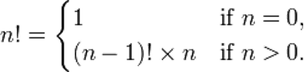
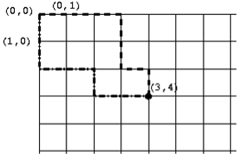
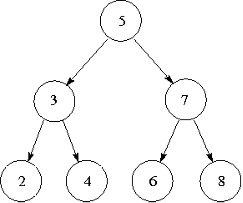

> <p>I warn this programme that any recurrence of this sloppy long-haired civilian plagiarism</p>
> <p>will be dealt with most severely</p>
{: .blockquote}

# Recursion

Here is a famous example of visual recursion often called the Droste effect. Droste is a Dutch chocolate maker. Notice that the box has a picture of the box on it, which itself has a picture of the box on it. If the picture were detailed enough, this would continue endlessly.


## Another Problem Solving Strategy
In this section, we will look into another way of solving problems. To do this, we will start with a very simple example.

Suppose we have the problem of summing a list of numbers (without using the existing sum function). This is an easy task, but we'll take a different approach to solving it than we've seen before. To be explicit, we need to write the body for this function definition:

<div class="viz">

```python
def add(numbers) :
    """Add up a list of numbers.
    
    Parameters:
        numbers (list): List of numbers to be summed.

    Return:
        float: Sum of all the values in 'numbers'.
    """
    pass # Something else goes here.
```
</div>

The `pass` keyword is a statement that does nothing when it is executed; it is known as a "no operation" statement, usually abbreviated to NOP or NOOP (pronounced "no-op"). It is useful as a placeholder when a block of code is needed but has not been written yet. When we write the function body, we will remove the `pass` statement.

Here is the plan: To add up a list of numbers, we will take the first number, and add on the sum of the remaining (all but the first) numbers. Check that this process will give the correct sum. Here is an expression which should get the first number of a list and add together the remaining numbers:

<div class="viz">

```python
numbers[0] + add(numbers[1:])
```
</div>

Notice what is happening here: that we are solving the problem of adding up a list of numbers by adding up a smaller list of numbers. To add up this smaller list of numbers, we can apply this process again, and add up an even smaller list of numbers, and so on. A function that computes a result by calling the same function is called a **recursive** function. **Recursion** is the method of problem solving by using recursive functions.

But there is a slight problem here: we are not really ever adding up the numbers, we are just constantly changing the problem to a smaller list of numbers. We need to decide on a point where it is more sensible to just return a result instead of trying to go further. That point comes when we have reached the smallest list possible, which is the empty list. If the list is empty, then the result of the sum should be 0 (when there are no numbers to add up, the total is zero).

Summarising, our strategy is now in two separate cases: if the list is empty, then the result is 0. Otherwise, the result is `numbers[0] + add(numbers[1:])`. This makes it very easy to write the function:

<div class="viz">

```python
def add(numbers) :
    """Add up a list of numbers.
    
    Parameters:
        numbers (list): List of numbers to be summed.

    Return:
        float: Sum of all the values in 'numbers'.
    """
    if not numbers :
        return 0
    else :
        return numbers[0] + add(numbers[1:])
```
</div>

We have seen plenty of examples of functions or methods whose definitions contain occurrences of other functions or methods. The above example shows that there is nothing to stop us defining a function that contains an occurrence of itself. Does this `add` function work? Download `add.py` to test it.

<div class="viz">

```python
>>> add([3, 8, 5])
16
```
</div>

<div class="aside">

#### Aside: Be Efficient 
Notice that each recursive step of our `add` function performs a list slice `numbers[1:]`, which essentially makes a copy of the whole list. Doing this at every step makes the recursive function inefficient. In the `next section`, we will return to the question of efficiency. A more efficient way to add a list of numbers would be to use a loop, or the built-in `sum` function.
</div>

## Using Recursion
What is involved in designing a recursive function? One is the **recursive step** case, which typically involves solving the problem by calling the same function with a slightly smaller input. Examples of “smaller input” are a list or string with the first element removed, or a number minus one. The other is the **base case** or termination case, which is typically on the smallest possible input, where solving the problem is typically a trivial task. For example, the input for a base case might be an empty list or string, or the number 0 (or another small number).

In the case of the `add` example, the recursive step is to say that the sum of the list `numbers` is given by `numbers[0] + add(numbers[1:])`, where `numbers[1:]` is our slightly smaller sub-problem. The base case is found when the list is empty, in this case the result is 0. It is useful to ensure that the base case deals with any situation that does not apply to the recursive step. In the `add` function, the expression `numbers[0] + add(numbers[1:])` doesn't work when the list is empty (since "`numbers[0]`" will raise an `IndexError`), so this must be handled by the base case.

It may be useful to explicitly study how the recursive `add` function computes a result. See the visualisation of the `add` function on BlackBoard.

When writing a recursive function, it is often helpful to apply wishful thinking. In this process, we assume that we can solve the problem with smaller inputs and think about how that could be used. That is, if we knew the solution to a smaller problem, how could we find the solution to our problem? Once that is answered, how does that recursive step eventually reach a “simplest case,” and how do we handle that case?

## Recursive Definitions

In computer science and mathematics, **recursive definitions** are definitions that refer to themselves. For example, one definition of the factorial function `n!` is:



A recursive definition is very easy to translate directly into Python code. The above definition of the factorial function can be represented in Python as:

<div class="viz">

```python
def factorial(n) :
    """Calculate the factorial of the given number 'n'.
     
    Parameters:
        n (int): Number for which the factorial is to be calculated.

    Return:
        int: Factorial of 'n'.
    """
     if n == 0 :
        return 1
    else :
        return factorial(n-1) * n
```
</div>

Do we really need recursion? Can’t we just write a while loop to do the work? How about the following definition?

<div class="viz">

```python
def factorial2(n) :
    """Calculate the factorial of the given number 'n'.
     
    Parameters:
        n (int): Number for which the factorial is to be calculated.

    Return:
        int: Factorial of 'n'.
    """
    factorial = 1
    while n != 0 :
        factorial *= n
        n -= 1
    return factorial
```
</div>

This certainly works — not exactly. Both versions have a problem if we supply them with a negative integer or a float. They will both go into 'infinite loops' as subtracting 1 will never reach the terminating condition `n == 0`. We really need to constrain `n` to be a non-negative integer.

It is clear that the recursive Python definition is an obviously correct implementation of the mathematical definition but it is not so clear that the non-recursive definition is a correct implementation. This is to be expected though — a recursive mathematical definition should have a more direct translation into a recursive program than a non-recursive one.

Still, recursion is not really needed here — we can work a bit harder and avoid recursion. Is this always the case? No — it turns out that there a certain kinds of problems that are just “inherently recursive”.

## A Counting Problem

As an example, we will write a recursive function to solve the following counting problem.

Consider the grid below, each corner is at integer coordinates. We start at the top-left, `(0,0)`, and we are allowed to move down and right along the lines in the grid to reach the coordinates `(x,y)`. The task to solve is, how many different paths can we take to reach the point `(x,y)`? For example, two possible paths from `(0,0)` to `(3,4)` are shown below.



We will write a function `num_paths(x, y)` to solve this problem. To solve a problem like this it can help to start with a pen and paper and try a few examples to get a handle on the problem. We can try this and use wishful thinking: if we knew the number of paths to other points on the grid, could we easily find the number of paths to the one we're interested in?

We quickly notice that every path to `(x,y)` must finish by going through either of the points next to it: `(x-1,y)` or `(x,y-1)`. How does this help? We can see from this that the number of paths to `(x,y)` is the sum of the number of paths to each of these adjacent points: 
`num_paths(x-1, y) + num_paths(x, y-1)`. *Here we have the recursive step*.

In finding the base case, we need to consider, what case does every recursive step eventually lead to? In this problem, the recursive step moves backwards along the grid, both left and up. This will eventually reach either the left or top edge (that is, when `x == 0` or `y == 0`). So now we consider, how many paths are there to a point on the top or left edges?

In fact, there is only one path, which goes either straight down or straight to the right. So, if `x == 0` or `y == 0`, the result is 1.

These observations lead to the following definition.

<div class="viz">

```python
def num_paths(x, y) :
    """Calculate the number of paths to point (x,y)
     
    Parameters:
        x (int): x coordinate of the point.
        y (int): y coordinate of the point.

    Return:
        int: Number of paths from (0,0) to (x,y).
    """

     if x == 0 or y == 0 :
        return 1
    else :
        return num_paths(x, y-1) + num_paths(x-1, y)
```
</div>

This turns out to be a simple, elegant solution. We argue that, without knowing the mathematical function for the number of paths, it is extremely difficult to write a non-recursive program to solve the problem.

## Recursive ADTs
Now we will look at a slightly different topic. We will start with a new ADT, the **binary search tree** (actually, a simplified version of it). A binary search tree is a way of storing a collection of values in order, which is useful in many applications where lots of data needs to be efficiently stored and accessed. A binary search tree is made of multiple **nodes**, each node contains these things:
- A value, which is the piece of information being stored. It can be any type of data that allows `==`, `< `and `> `comparisons.
- An optional “left child”, which is another node. All the nodes to the left of this one (called the left subtree) must have values that are less than the value of this node.
- An optional “right child”, which is another node. All the nodes to the right of this one (the right subtree) must have values that are greater than or equal to the value of this node.
To visualise this definition, the diagram below shows a common way to represent a tree. Each node is a circle with the value inside. The top-most node (in this case, the one with value 5) is called the **root**, which can be used to access the entire tree. Nodes without any children (in this case, 2, 4, 6, and 8) are called **leaves**.



Take a moment to understand how this diagram relates to the definition above. For example, 3 and 7 are the left and right children of 5. The nodes with 2, 3 and 4 make up the left subtree of 5. We should also check that each node satisfies the "less than" and "greater than" properties described. 5 is greater than 2,3,4 and less than 6,7,8. 3 is greater than 2 and less than 4. 7 is greater than 6 and less than 8.

There is an important idea that has been introduced in this ADT: nodes store other nodes. This is an example of a **recursive ADT**, a data type which stores other instances of itself. These nodes can themselves store other nodes, and so on. They are analogous to a recursive step in a recursive function. Leaf nodes are analogous to a base case in a recursive function, because they are the simplest type of node, and also where the path of “travelling along” nodes stops. One other interesting property of the binary search tree is that each subtree is itself a tree: for example, the nodes 2, 3 and 4 form a tree by themselves.

Nodes in a binary search tree can support the following operations:
- `Node.insert(value)` — insert a new value into one of the subtrees of this node, preserving the tree ordering property.
- `Node.to_list()` — return a sorted list of values of this node and its subtrees.
- `value in node` — a boolean test that checks if this value is stored in this node or its subtrees.

All of these are easiest to implement recursively, which is helped by the recursive nature of the tree structure. Let’s start writing a `Node` class to represent nodes. When a node is created, it has no children yet, so we will use `None` to represent indicate that there are no left or right sub-trees.

<div class="viz">

```python
class Node(object) :
    """A node in a binary search tree."""

    def __init__(self, value) :
        """A new Node in a Binary Search Tree
     
        Parameters:
            value: Element to be stored in this Node. 
                   Must be comparable by ==, > and <.
        """
        self._value = value
        self._left = None
        self._right = None
```
</div>

For the `insert` method, the value should be added as a new node in either the left or right subtree, whichever is appropriate. Note that the method does this by making recursive calls to `insert` on other nodes. The “base case” is when the left or right child does not exist, so a new `Node` is created. Note also that if the value being inserted is equal to the value, it will go in the right subtree, but there is no reason it cannot go in the left subtree instead.

<div class="viz">

```python
    def insert(self, value) :
        """Add 'value' into this Node in the search tree.
     
        Parameters:
            value: Element to be stored in this Node. 
                   Must be comparable by ==, > and <.
        """
        if value < self._value :
            if self._left is None :
                self._left = Node(value)
            else :
                self._left.insert(value)
        else :
            if self._right is None :
                self._right = Node(value)
            else :
                self._right.insert(value)
```
</div>

To write the `to_list` method, we can use this rationale: all the nodes in the left subtree will be less than the current node, so recursively calling `self._left.to_list()` will give us the first portion of the list in sorted order. We can then append the current value. Similarly, a call to `self._right.to_list()` will give us the last portion of the list in sorted order, which can be extended onto the end. Notice that the base case is not explicitly written, but it is still there: if both of the children are `None`, then no recursive calls will be made.

<div class="viz">

```python
    def to_list(self) :
        """Return a sorted list of the values of this Node's children."""
        result = []
        if self._left is not None :
            result.extend(self._left.to_list())
        result.append(self._value)
        if self._right is not None :
            result.extend(self._right.to_list())
        return result
```
</div>

To use the `value in node` syntax, a class must implement the `__contains__` method and return `True` or `False`. We will determine if the value we are searching for is greater or less than the current node’s value, then we will search for the value in either the right or left subtree. Notice below that `value in self._left` and `value in self._right` are actually recursive steps, because they both use the same `__contains__` method on a subtree. If the value is the one that we are searching for, we can return `True`, otherwise, there is no other way to find the value and we return `False`, these are both base cases.

<div class="viz">

```python
    def __contains__(self, value) :
        if value == self._value :
            return True
        elif value < self._value and self._left is not None :
            return value in self._left
        elif value > self._value and self._right is not None :
            return value in self._right
        else :
            return False
```
</div>

Lastly, we can implement a `__str__` method:

<div class="viz">

```python
    def __str__(self) :
        return "({0}, {1}, {2})".format(self._left, self._value, self._right)
```
</div>

How does this work? When performing the `.format` on each child, if the child is `None`, then `"None"` will appear in the string result. If the child is a `Node`, then `.format` method will recursively call `str` on that node. This is an example of the potential for writing very elegant recursive functions.

It is sometimes much easier to write a function recursively than iteratively, and being able to work with recursive methods is an important skill.

For completeness, we will also give an implementation of a binary search tree class, which simply keeps track of the root node (if there is one — the tree might not have any nodes) and refers to the root node when its methods are called. The two classes can be downloaded: `search_tree.py`

<div class="viz">

```python
class BinarySearchTree(object) :
    """A binary search tree."""

    def __init__(self) :
        """A new empty binary search tree."""
        self._root = None

    def insert(self, value) :
        """Add 'value' into the tree.
        
        Preconditions:
            'value' is comparable by at least the ==, > and < operators.
        """
        if self._root is None :
            self._root = Node(value)
        else :
            self._root.insert(value)

    def to_list(self) :
        """Return a sorted list of the values in this tree."""
        if self._root is None :
            return []
        return self._root.to_list()

    def __contains__(self, value) :
        return self._root is not None and value in self._root

    def __str__(self) :
        if self._root is None :
            return "()"
        return str(self._root)
```
</div>

Here are some examples of using this tree. The interaction below creates a tree with the same structure as the diagram above, the second is a simple function that sorts a list of numbers that takes advantage of `to_list`. Study the output of `print(tree)` and relate it to both the diagram and the `Node.__str__` method above.

<div class="viz">

```python
>>> tree = BinarySearchTree()
>>> for v in [5, 3, 2, 4, 7, 6, 8]:
        tree.insert(v)

>>> print(tree)
(((None, 2, None), 3, (None, 4, None)), 5, ((None, 6, None), 7, (None, 8, None)))
>>> tree.to_list()
[2, 3, 4, 5, 6, 7, 8]
>>> 4 in tree
True
>>> 7.5 in tree
False


>>> def tree_sort(lst) :
        """A sort implementation using a tree.
        
        Parameters:
            lst: List of elements to be sorted.

        Return:
            Sorted list of elements.

        Preconditions:
            All elements of 'lst' are comparable by 
            at least the ==, >, and < operators.
        """
        tree = BinarySearchTree()
        for element in lst :
            tree.insert(element)
        return tree.to_list()
```
</div>

<div class="aside">

#### Aside: An advanced implementation 
Some students may wish to challenge themselves and experiment with another implementation of a binary search tree. `search_tree2.py` contains a more elegant implementation, as well as support for the len function and for-loops (using content from the optional material on functional programming.
</div>

<div class="aside">

#### Aside: Is recursion necessary? 
The problems we have looked at in this section were solved by writing recursive functions, but did we need to use recursion? When can a recursive function be written iteratively (using a loop) instead?

A function is **tail recursive** if the recursive call is the last thing that happens before the function returns. Tail recursive functions can be directly translated into an iterative function. In fact, some other programming languages will notice when tail recursion is used and optimise it so it behaves iteratively.

For example, the `Node.insert` method is tail recursive, because when the `insert` method is called recursively, that is the last step the function takes. The `insert` method can be defined iteratively as below.

<div class="viz">

```python
    def insert(self, value) :
        """Add a value into this node in the search tree."""
        node = self
        while True :
            if value < node._value :
                if node._left is None :
                    node._left = Node(value)
                    break
                else :
                    node = node._left
            else :
                if node._right is None :
                    node._right = Node(value)
                    break
                else :
                    node = node._right
```
</div>

However, with a good understanding of recursion, many people would prefer the original recursive method.

The `__contains__` method is also tail recursive, and can similarly be defined using a while loop. However, `to_list` and `__str__` are not tail recursive, because after a recursive call is made, there is still more work to be done before returning the result. These two methods are very difficult to write without using recursion. The `num_paths` function above is also not tail recursive, and cannot easily be translated into an iterative function.

Note however that there are functions, such as `add` and `factorial` from earlier, which are not tail recursive but can be rewritten iteratively using a bit more thought.
</div>