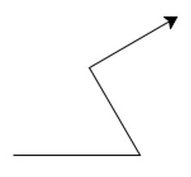
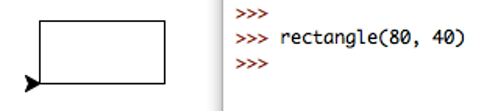
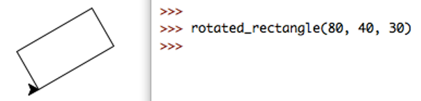
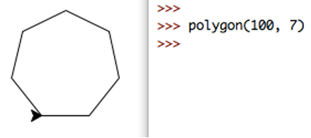
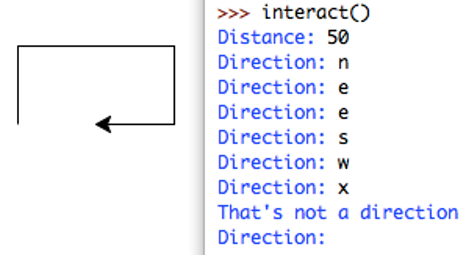
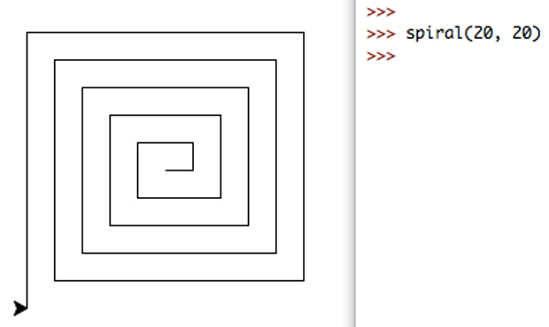

# Functional Decomposition

#### Leap Years

Convert the leap year program you wrote in week 2 to a function. The function should take a single integer parameter representing a year (e.g. 2018), and return: `True` if the year is a leap year, and `False` if not.

Write a docstring comment for your function that explains how it is to be used.

As a reminder, a leap year occurs when the year is a multiple of four, unless the year is a multiple of 100. However, if the year is a multiple of 400, then it is a leap year. For instance, 2016 and 2000 are leap years, but 2100 is not.

#### Turtle Logic

In this task, we will use the `turtle` graphics module for drawing basic shapes, by moving a 'turtle' across the screen, drawing a path as it travels. We can use the turtle functionality if we put the line `import turtle` at the top of our file. The turtle module contains many functions, we will use the following:


- `turtle.forward(distance)` moves the turtle forward by a given distance.
- `turtle.back(distance)` moves the turtle backwards.
- `turtle.left(angle)` turns the turtle left by `angle` degrees.
- `turtle.right(angle)` turns the turtle right.
- `turtle.setheading(angle)` sets the turtle's direction in degrees (0 is east, 90 is north, 180 is west, 270 is south).
- `turtle.reset()` removes all drawings and moves the turtle back to its original position and orientation.
- `turtle.exitonclick()` sets the window to close when clicked.
- `turtle.bye()` closes the window. Clicking the close icon on the window may not work.

<div class="important">

**Note**: See [https://docs.python.org/3.6/library/turtle.html](https://docs.python.org/3.6/library/turtle.html) for a more complete description of the `turtle` module.

</div>

The turtle begins facing 'east' (i.e. to the right). For example, the following code produces the image below. 

<div class="viz">

```python
import turtle

def demo() :
	"""Turtle demo."""
	turtle.forward(100)
	turtle.left(120)
	turtle.forward(80)
	turtle.right(90)
	turtle.forward(80)
	turtle.exitonclick()

if __name__ == "__main__" :
	demo()
```

</div>



Create a file which contains the following functions. NOTE: 
- Put the line `import turtle` at the top of your code.
- DO NOT save your file as `turtle.py`, this will cause the import to fail. Choose a different file name, but make sure you add the `.py`. If you do save your file as turtle.py, you must delete or rename your file. 
- Be sure to call `turtle.exitonclick()` after drawing, either by putting at the end of your main function or manually running it through IDLE (otherwise, the turtle window will crash when running in IDLE). 

1. `rectangle(width, height)`, which draws a rectangle with the given side lengths. Ensure that the cursor finishes pointing east.



2. `rotated_rectangle(width, height, angle)`, which draws a rectangle rotated anticlockwise by the given angle. Ensure that the cursor finishes pointing east. 



**Hint**: This can be done in only four lines of code, including the `def ...`, and not including the function comment. 

3. `polygon(radius, num_sides)`, which draws a regular polygon with n sides, and side length `radius * sin(π / num_sides)`.



**Hint**: If the turtle moves anti-clockwise, it will turn a total of 360°, in `n` equal movements. The `math` module contains trigonometric functions and mathematical constants. Remember to `import math`. 

4. `interact()`, which first asks the user for a distance, then repeatedly asks for a direction to move, from the options `n/s/e/w` (north/south/east/west respectively), and then moves in that direction by the given distance. If the user enters `q`, the turtle window closes and the function ends. If the user enters any other input, an error message is printed, as in the example.



<div class="extra">

**Challenge: Square Spirals**
Write a function `spiral(num_lines, step_size)`, which draws a square spiral with `num_lines` lines, which starting from the centre have length `s, s, 2s, 2s, 3s, 3s, …,` where `s = step_size` (note that this is also the distance between two adjacent parallel lines). The example below shows a spiral of 20 lines, which makes five full revolutions, with a step size of 20. 

</div>

