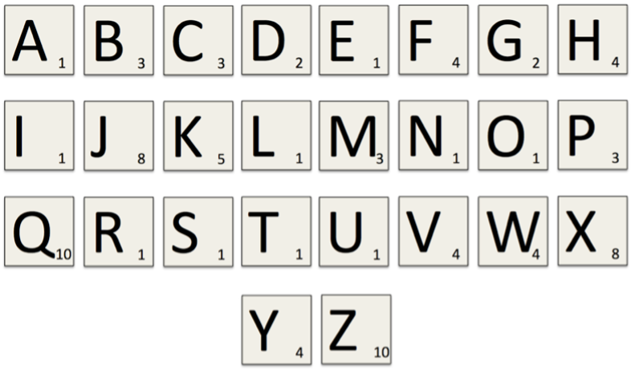

# Debugging and Dictionaries
## Bug Swatting

Your tutors have tried to write a program that finds the first `n` prime numbers, for an integer `n`. Unfortunately, we’re all noobs. Our code has several bugs in it and we need some help. The code is shown below; your task is to find and fix the errors. This code can also be downloaded as `week05_primes.py`. 

<div class="viz">

```python
def is_prime(n) :
    """Returns True iff 'n' is prime.

    Parameters:
        n (int): Integer value to be tested to see if it is prime.

    Return:
        bool: True if 'n' is prime. False otherwise.

    Preconditions:
        n > 1
    """
    for i in range(2, n) :
        # Check if i is a factor of n
        if n % i == 0 :
            return False
        else :
            return True


def get_primes(n) :
    """Return a list of the first n primes.

    Parameters:
        n (int): Number of prime numbers to find.

    Return:
        list[int]: The first ‘n’ prime numbers.

    Preconditions:
        n > 0
    """
    primes = ''
    i = 2
    while len(primes) < n :
        if is_prime(i) :
            primes.append(i)
            i += 1

n = int(input("How many primes? "))
print("The first" + n + "primes are:", primes)
```
</div>

The following example shows how the program should work: 

<div class="viz">

```
How many primes? 7
The first 7 primes are: [2, 3, 5, 7, 11, 13, 17]
```
</div>

## Scrabble Scoring
In the game *Scrabble*, points are scored by summing the value of the letters in a word. Different letters are assigned different values, based on how difficult it is to use the letter in a word. Below is a table that maps each letter to its corresponding value.


<div class="viz">

```python
SCRABBLE_VALUES = (
    ('a', 1), ('b', 3), ('c', 3), ('d', 2), ('e', 1),
    ('f', 4), ('g', 2), ('h', 4), ('i', 1), ('j', 8),
    ('k', 5), ('l', 1), ('m', 3), ('n', 1), ('o', 1),
    ('p', 3), ('q', 10), ('r', 1), ('s', 1), ('t', 1),
    ('u', 1), ('v', 4), ('w', 4), ('x', 8), ('y', 4),
    ('z', 10)
)
```
</div>

1. Download the file `week05_scrabble.py`. This file contains a tuple of the letters in the alphabet with their corresponding scrabble value. Write a function `read_scores` which takes a tuple like this as an argument and creates a dictionary that maps letters to their scrabble score. 

    Why can’t we create a dictionary that does the reverse — that is, maps a scrabble score to the letter which gains that score?

2. Write a function `get_score(scores, word)`, that takes as input the scores dictionary and a string containing a word, and returns the word’s scrabble score. (You may assume that the input string only consists of lowercase letters.) For example:

    <div class="viz">

    ```python
    >>> scores = read_scores('scrabble_scores.txt')
    >>> get_score(scores, 'quack')
    20
    ```
    </div>

3. Modify your `get_score` function so that it now ignores characters for which it does not have a corresponding score:
    <div class="viz">

    ```python
    >>> get_score(scores, '%fishing_')
    14
    ```
    </div>

<div class="extra">

#### Challenge: Make it a Class 
Create a `ScrabbleScore` class that has methods `read_scores` and `get_score`. These methods should have the same functionality as the two functions described above. Explain why it is more appropriate to implement this functionality as a class than as two separate functions.
</div>

## Frequency Analysis
In cryptography, one method that can be applied to cracking a secret message is *frequency analysis*. Frequency analysis involves determining how many times each letter occurs in a given message and then, based on what language you are using, guessing certain letters, (for instance, in English the most used character is ‘e’, so you might guess the most frequently occurring letter in a secret message is actually ‘e’). 

1. Write a function `letter_frequency(message)`, which takes as input a string message and returns a dictionary mapping the characters used in the message to the number of times they occurred in the message. Upper-case and lower-case letters are considered the same and non-alphabetical characters should be ignored:

    <div class="viz">

    ```python
    >>> letter_frequency('secrets')
    {'S': 2, 'E': 2, 'C': 1, 'R': 1, 'T': 1}
    ```
    </div>

2. Write a function `max_letter(freqs)`, which takes as input a dictionary mapping letters to occurrences, like you would get from part 1. It should return the letter with the highest frequency, or in the case of a tie, any 1 of the most common letters:

<div class="extra">

#### Challenge: Multiple Max Frequencies 
Modify the `max_letter` function to instead return a list of all the letters with the highest frequency. e.g. If there is a tie in the maximum frequency a list of multiple letters should be returned. If there is only one highest frequency, return a list with a single element in it.
</div>
