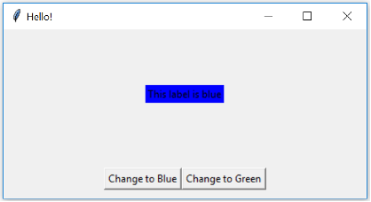

# Graphical User Interfaces – Part 1
## Blue and Green
In this week’s tutorial, we will build a small application which has a `Label` and some commands to change the colour of the label. 
Download the file `week09_gui1_starter.py`, which contains code to run a simple application which greets the user when they click the button. Run this code and examine how it works. Modify this code to show the following layout: 

Note that there should be a vertical padding of 10 pixels around the buttons (so that the buttons do not touch the bottom of the window). If the user increases the window size, the buttons should stay at the bottom, and the label should stay roughly in the centre of the window. 
Next, modify the class so that clicking the buttons modify the text and colour of the label, as follows: 

    
    

#### Hint:
Use packing options, such as `anchor`, `expand`, `fill`, and `padx`/`pady`/`ipadx`/`ipady`, to achieve the desired layout. You may also need to use frames.
Use the `.config` method to modify the text and colour (`bg` for background colour) of the `Label`.	

## What... is Your Favourite Colour?
We will now expand the program to allow the user to enter their own choice of colour. Modify the program to show the following layout: 

There should be a 10 pixel padding around all four sides of the bottom row, and the 10 pixel vertical padding on the middle row should be removed (otherwise, if there was 10 pixels of padding on both rows, it would look like a total gap of 20 pixels — the gap which appears in the screen shot is padding on top of the bottom row, not padding below the middle row). If the user increases the window size, the `Entry` widget should grow horizontally. 

#### Hint: Simple Text Box 
Tkinter’s `Entry` widget allows the user to type a single line of text into an application. The `.get()` method retrieves the current value from the `Entry`. 
See `the notes on the Entry Widget`. 

Next, modify the class so that the 'Change it!' button changes the colour and text of the label based on the text in the entry widget. For example, 

(Try some of [these colours](https://www.tcl.tk/man/tcl8.5/TkCmd/colors.html#M3) in your program!) 

## That’s Not a Colour!
Modify the program so that if the text in the entry widget is not a colour, an error box appears, for example: 

#### Hint: Tkinter Error Messages 
To display an error message box, we use the `messagebox` library. First, import `messagebox` from `tkinter`, then `messagebox.showerror("title", "message")` will display an error box with the given title and message. 

If a widget’s `config` method is called with an invalid background colour, then it will raise a `tk.TclError`. So, we can tell if a colour is valid by trying to configure the label, and checking if `config` raises this error.

