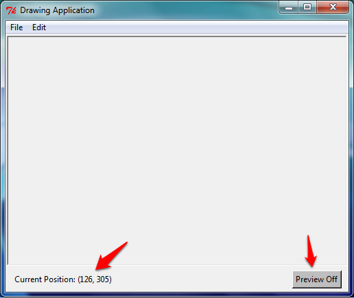
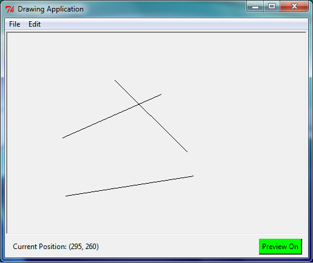

# Graphical User Interfaces – Part 2
## Find My Position

In this tutorial, we will build an application which allows the user to draw straight lines with their mouse. To start with, download and run the file `week10_gui2_starter.py`, which creates a `Canvas`, a `Frame` (using a custom `SettingsFrame` class that inherits from `Frame`), and a `Menu`. The `SettingsFrame` contains a `Label` and a `Button`. 

In the finished application, users will be able to click on the canvas, move the mouse to see a preview of the line, then click again to finish drawing the line. The user will also be able to turn the preview on or off. Your tutor will demonstrate how a finished version should work. 

Modify the program so that moving the cursor over the canvas changes the "Current Position" label to the position of the cursor, as in the following example. (Hint: You will need to edit the provided `evt_motion` and `set_position` methods.) 

Next, modify the `SettingsFrame` class so that, if the "Preview On" button is clicked, it will turn grey and change its text to "Preview Off" (as in the screen shot above), and if clicked again, it will go back to green with "Preview On". 

Also write the method `is_preview_on` to return `True` or `False` depending on the preview setting (we will use this method later when we write the code which draws the preview lines). 

#### Hint:
When a mouse event occurs, the `.x` and `.y` attributes tell us where the mouse is; use this to configure the label. The string `.format` method could be useful to format the information.

To keep track of whether the preview option is on, create an extra boolean attribute of the class!

## The Line Must Be Drawn *Here*!
Modify the program so that when the user clicks in two locations, the application will draw a line between those two points. A third and fourth click should draw a second line, two further clicks should draw a third line, and so on.

#### Hint:
Bind a method to `'<Button-1>'` to find out when the mouse is clicked. You may need to create attributes in the class to store certain information, such as whether or not the user has made the first click of a line, and where that click was made. 
Use the Canvas’ `create_line` method to draw a line, for instance:
	`self._canvas.create_line((100, 100), (200, 200)). `

## I Need to See Where I’m Going
Modify the program so after the first click, the user will see a 'preview' of their line which follows the cursor, but only if the preview button is set to "On" (use the `is_preview_on` method that we wrote earlier to tell if the preview line should be drawn; recall that this method returns `True` if the line should be drawn). 

#### Hint:
One way to accomplish this is to first add a method which deletes all items on the Canvas (`self._canvas.delete(tk.ALL)`), then redraws all items that should be present. To do this, create a list attribute in the class to store information about all the lines in the application (for example, the two pairs of coordinates), so that the entire drawing can be remade from the list.

Another way to do this is to just change the coordinates of the preview line whenever the mouse moves. To do this, store the return value of the call to `create_line` which creates the preview line (this return value is an integer which the canvas uses to uniquely identify the line). Then, to move the preview line, call the canvas’ `coords` method: `self._canvas.coords(ID, x1, y1, x2, y2)` with the line’s ID as the first parameter, and the new coordinates as the four remaining parameters.

Depending on what information is stored in the class, you may need to modify the `clear` method to reset this information (otherwise previously deleted lines might reappear).

