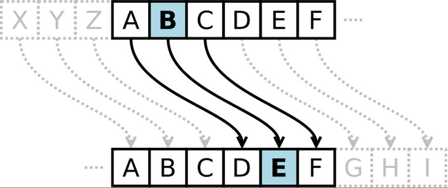

# Lambdas & List Comprehension
## Map, Filter and Reduce

There are a few functions in Python that allow you create and alter lists, in useful ways, without having to use large, cumbersome for loops. These functions are `map`, `filter` and `reduce`, and they each make use of lambda functions to perform their associated task. For the most part, these functions are somewhat inferior to using the list comprehension syntax in Python but they do have their niche purposes. In this tutorial we will make use of both constructs to get a feel for both list comprehensions and using lambda functions
1. Given a list of Fahrenheit temperatures, produce a list of converted Celsius temperatures, rounded to 1 decimal point:
    1. Using a singular list comprehension
    2. Using the built-in `map` function and lambda functions

    

    <h4>Map</h4>

    The map built-in function takes two arguments:
    1. A function which takes one element and returns the new transformed element.
    2. An iterable (list, string, tuple etc.) which then has the function applied to each element.
    It then returns a map object, which can be converted to a list using `list()`.
    

2. Given a list of integers, produce a list that only contains the numbers from the previous list that are both even and greater than 15:
	1. Using a singular list comprehension
	2. Using the built-in `filter` function and lambda functions

    

    <h4>Filter</h4>

    The `filter` built-in function takes two arguments:
    1. A function which takes one element and returns `True` if the element should be in the filtered set, or `False` if it should not
    2. An iterable (list, string, tuple etc.) which then has the function applied to each element
    It then returns a filter object, which can be converted to a list using `list()`
    

3. Produce a list of the squares of every odd number up to 30:
	1. Using list comprehension
	2. Using `map`, `filter` and lambda functions
4. Using the `reduce` function from the `functools` module and an appropriate lambda function, calculate the maximum number in a list.

    

    <h4>Reduce</h4>

    The reduce function is a bit more complex. It takes two arguments:
    1. A function which takes two arguments and returns a single result
    2. An iterable (list, string, tuple etc.) which has the function applied to its elements
    The function is applied cumulatively to the elements in the list from left to right. To clarify, the function is applied to the first two elements of the list. The function is then applied again using the result of the first function call as argument one and the third element of the list as argument two. This process repeats until the list is exhausted.
    
    

    **Note**: Remember to import reduce from the functools module!
    

    

## Caesar Cipher
A Caesar Cipher (also known as a shift cipher) is a very simple type of cipher in which each letter in the alphabet is shifted along a set number of characters to produce the encrypted message. For example, with a ‘shift’ of 3, A becomes D, B becomes E, C becomes F etc.

Using list comprehensions or lambda functions, implement a Caesar Cipher with shift 3. You may assume the message string consists of entirely uppercase characters. Your implementation should take a string message and return a newly encrypted string.

#### Hints:
You can get a string of all uppercase characters by importing ascii_uppercase from the string module:
	`from string import ascii_uppercase`
You may find the built-in functions ord and chr useful, in conjunction with an ASCII table

#### Challenge: Advanced Cipher
Modify your Caesar Cipher so that it can now handle spaces in the original message. The encrypted messages should have spaces where the original had them.

